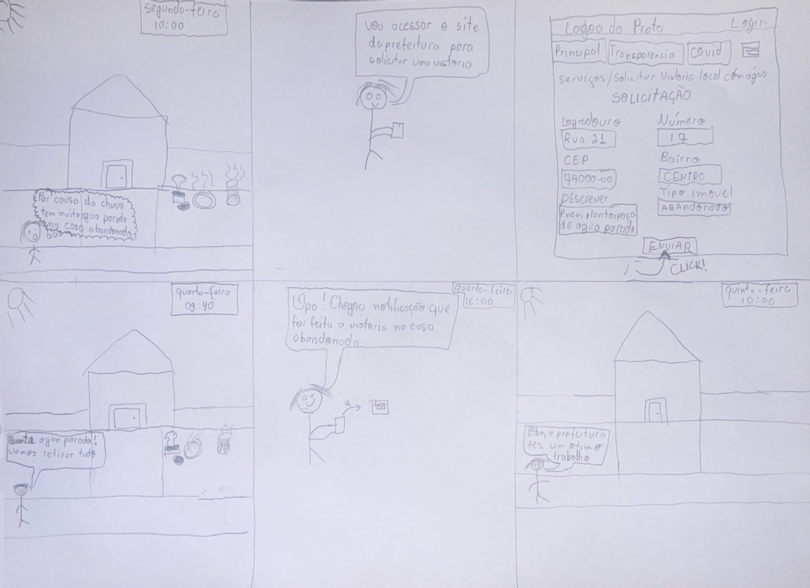

## Introdução

O storyboard é um exemplo de protótipo de baixa fidelidade que possui tanto o design contextual[2] e o baseado em cénarios [3]. Ele é utilizado devido a sua simplicidade, rápida produção e baixo custo de produção. Cada integrante do grupo pegou uma das tárefas definidas na [Análise de Tarefas](../../../requisitos1/analise-tarefas.md) e baseado nos [Cénarios](../../../requisitos1/cenarios.md) definidos e produziu um storyboard com o objetivo de relatar as funcionalidades da funcionalidade sem especificar como ele será utilizado ou como será a aparência do sistema, dando um foco maior na narrativa.
Os storyboards a seguri devem conter os seguintes elementos:

- Pessoas envolvidas;
- Um contexto e ambiente bem definidos;
- Quais passos a pessoa deve realizar;
- Motivos para usar a funcionalidade;
- O que é preciso ser feito para a tarefa ser completada;
- A satisfação ao final da pessoa ao finalizar a tarefa;

## Storyboards
### Cadastrar e acompanhar uma reclamação na ouvidoria - Cainã Freitas
Na figura 1 abaixo, apresenta-se um storyboard em que o usuário após receber uma reclamção da filha de não receber lanche na escola registra uma reclamação na ouvidoria no site da Prefeitura.

**Figura 01** - Storyboard de reclamação na ouvidoria

*Fonte: [FREITAS, CAINÃ.](https://github.com/freitasc) 2024.*

### Cadastro antecipado de aluno - Joyce
Na figura 2 abaixo, apresenta-se um storyboard em que o usuário deseja fazer o cadastramento do filho na escola e após receber instruções de outra pessoa realiza o cadastro do aluno no site da Prefeitura.

**Figura 02** - Storyboard de Cadastro antecipado de aluno

*Fonte: [DIONIZIO, JOYCE.](https://github.com/joycejdm) 2024.*

### Acessar módulo de contra cheque e consultar processos do servidor - Augusto
Na figura 3 abaixo, apresenta-se um storyboard em que o usuário deseja fazer o cadastramento do filho na escola e após receber instruções de outra pessoa realiza o cadastro do aluno no site da Prefeitura.

**Figura 03** - Storyboard de Acessar módulo de contra chque e consulta

*Fonte: [CAMPOS, AUGUSTO.](https://github.com/Augcamp) 2024.*

### Registrar e verificar o panorama de saúde da cidade - Lucas Meireles
Na figura 4 abaixo, ########DESCRIÇÃO DO STORYBOARD############

**Figura 04** - Storyboard de Acessar módulo de contra chque e consulta

*Fonte: [MEIRELES, LUCAS.](https://github.com/Katuner) 2024.*

### Solicitar vistoria de local com água parada - Pedro Lucas
Na figura 5 abaixo, apresenta-se um storyboard em que o usuário após ver uma casa com varios locais com água parada decide entrar no site e fazer a solicitação de vistoria de local, depois que a vistoria é feita por um agente da Prefeitura o usuário recebe a notificação de que a vistoria foi feita e vai no local para checar ficando feliz com o trabalho bem feito da prefeitura.

**Figura 05** - Storyboard Solicitação de vistoria de local com água parada

*Fonte: [DOURADO, PEDRO LUCAS.](https://github.com/lucasdrau) 2024.*

## Bibliografia

> [1] Barbosa, S. D. J.; Silva, B. S. da; Silveira, M. S.; Gasparini, I.; Darin, T.; Barbosa, G. D. J. (2021) Interação Humano-Computador e Experiência do usuário. Autopublicação.

> [2] Beyer, Hugh e Holtzblatt, Karen (1997). Contextual Design: Defining Customer-Centered Systems. Morgan Kaufmann Publishers Inc., San Francisco, CA, USA

> [3] Rosson, Mary Beth e Carroll, John M (2002). Usability engineering: scenario-based development of human-computer interaction. Morgan Kaufmann.

## Historico de Versões

|    Data    | Versão |                         Descrição                         |                                  Autor(es) | Data de revisão | Revisor(es) |
| :--------: | :----: | :-------------------------------------------------------: | -----------------------------------------: | :-------------: | :---------: |
| 08/07/2024 | `1.0`  | Criação do documento e estruturação completa do documento | [Pedro Lucas](https://github.com/joycejdm) |                 |             |
