## Introdução

Os protótipos de alta fidelidade feitos desempenham um papel crucial no processo de design e desenvolvimento de sites, permitindo que designers e desenvolvedores testem e refinem suas ideias com um alto nível de detalhamento antes de se comprometerem com a implementação completa. Esses protótipos servem como uma visualização interativa quase real do produto final, permitindo que os usuários testem funcionalidades, navegação e forneçam feedback valioso.

Durante a fase de design e desenvolvimento de um site, os protótipos de alta fidelidade são essenciais para explorar e comunicar conceitos, layouts e fluxos de interação de maneira precisa e eficaz. Utilizando ferramentas avançadas do Figma, como componentes reutilizáveis, interações e animações, esses protótipos facilitam uma colaboração detalhada e iterativa entre as equipes de design e desenvolvimento.

Além disso, obter feedback dos usuários através de protótipos de alta fidelidade é fundamental para assegurar a usabilidade e a satisfação do público-alvo. Ao observar e entrevistar os usuários durante a interação com esses protótipos, é possível identificar problemas de usabilidade, áreas de confusão e oportunidades de melhoria com uma fidelidade próxima ao produto final. Essas informações são vitais para aprimorar o design do site, otimizar a experiência do usuário e minimizar retrabalhos nas fases posteriores do desenvolvimento.

## Objetivo 
O objetivo de realizar a avaliação somativa é julgar a qualidade de uso de uma solução de IHC buscando evidências que indiquem que as metas de design foram alcançadas. (Bruno Silva e Simone Barbosa)[1]
Com relação ao objetivo deste documento, que é realizar o relato dos resultados obtidos na avaliação do protótipo de alta fidelidade com relação a tarefa de "Solicitação de vistoria de local com água parada", realizado pelo integrante do grupo [Pedro Lucas](https://github.com/lucasdray).

## Metodologia
Para realização da avaliação somativa do protótipo foi utilizado o método de observação somado ao teste de usabilidade que "visa a avaliar a usabilidade de um sistema interativo a partir de experiências de
uso dos seus usuários-alvo" (Rubin, 1994; Rubin e Chisnell, 2008). Com isso foi seguido a recomendação de Dumas e Redish [2], que afirmam que uma avaliação de IHC deve envolver de cinco a doze usuários, sendo que cinco já são suficientes para detectar a maioria dos problemas, como relata Nielsen [3]. Portanto a seguir estão listadas todas as metodologias utilizadas tanto na avaliação como no relato dos resultados.

- **Observação direta**: Consiste na observação sistemática dos usuários durante a execução das tarefas. Isso pode incluir a coleta de dados qualitativos, como comportamentais, e quantitativos, como métricas de desempenho.

- **Teste de Usabildiade**: Os usuários-avlo testam a usabilidade de um sistema interativo baseando-se em experiências anteriores de uso.

- **Entrevista**: Realizadas com os usuários após a simulação de uso, com o objetivo de coletar informações sobre a experiência de uso do protótipo de papel.

- **Questionário**: Aplicados aos usuários após a simulação de uso, com o objetivo de coletar informações sobre a experiência de uso do protótipo de papel.

- **Grupos focal**: Realizados com os usuários após a simulação de uso, com o objetivo de coletar informações sobre a experiência de uso do protótipo de papel.

## Tarefa
A tarefa que foi testada e que será relatada nesse documento é a tarefa de "Solicitação de vistoria de local com água parada" descritar melhor na [Análise Hierárquica de Tarefas 5](https://interacao-humano-computador.github.io/2024.1-Prefeitura-Lagoa-da-Prata/requisitos1/analise-tarefas/#analise-da-tarefa-hta-5-solicitar-vistoria-de-local-com-agua-parada) e [Análise de Tarefas CNM-GOMS 8](https://interacao-humano-computador.github.io/2024.1-Prefeitura-Lagoa-da-Prata/requisitos1/analise-tarefas/#analise-da-tarefa-cnm-goms-8-solicitar-vistoria-de-agua-parada-fonte-dourado-pedro-lucas-2024).

## Protótipo de Alta Fidelidade
O protótipo de alta fidelidade foi feito de acordo com todos os artefatos produzidos ao longo da disciplina na análise de requisitos, sendo eles: [Principios Gerais](../../requisitos2/principios_gerais.md), [Metas de Usabilidades](../../requisitos2/metas-usabilidade.md), [Guias de Estilo](../../requisitos2/guia-de-estilo.md) e [Caracteristicas da Plataforma](../../requisitos2/caracteristicas.md).

Abaixo se encontra as figuras com relação ao protótipo de alta fidelidade realizado para essa tarefa na ferramente Figma[4] e o script utilizado no teste piloto e entrevistas.

**Figura 01** - Script da tarefa Solicitação de vistória de água parada

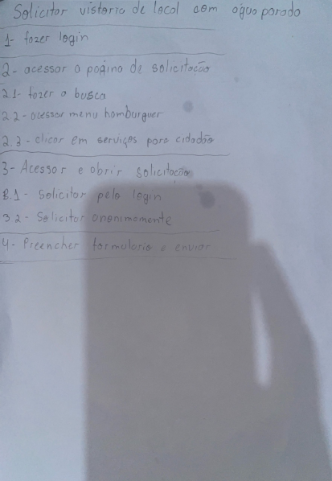

*Fonte: [DOURADO, Pedro Lucas](https://github.com/lucasdray). 2024.*

<iframe style="border: 1px solid rgba(0, 0, 0, 0.1);" width="800" height="450" src="https://www.figma.com/embed?embed_host=share&url=https%3A%2F%2Fwww.figma.com%2Fdesign%2FzzcDffXN5b4OTbcvuviERJ%2FSa%25C3%25BAde---IHC%3Fnode-id%3D15-510%26t%3DSOQrhTkCKCfLWDa9-1" allowfullscreen></iframe> 

A seguir se encontra as imagens separadas de cada tela do protótipo de alta fidelidade sendo elas classificadas de acordo com os números de cada atividade no script.

### 1 - Realizar login
Abaixo na figura 02, se encontra a tela homepage do protótipo e que a atividade seria de realizar o login.

**Figura 02** - Homepage

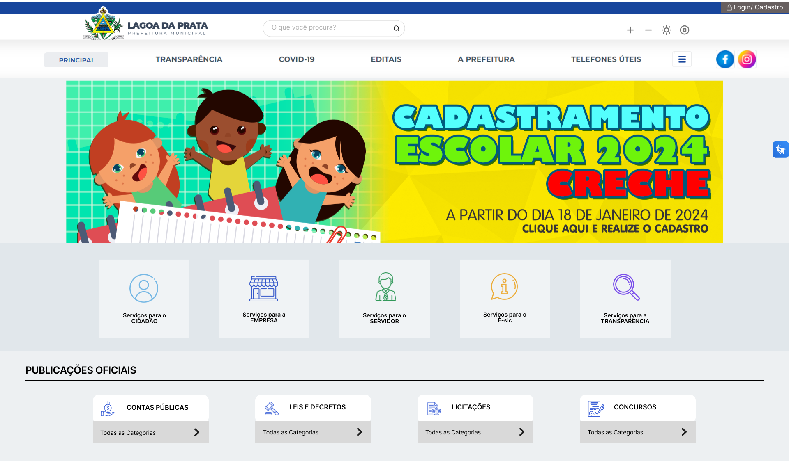

*Fonte: [DOURADO, Pedro Lucas](https://github.com/lucasdray). 2024.*

### 2.1 - Acessar página de solicitação pela busca
Abaixo se encontra a tela do protótipo após realizar a busca encontrado na figura 03 abaixo.

**Figura 03** - Acessar página de solicitação pela busca

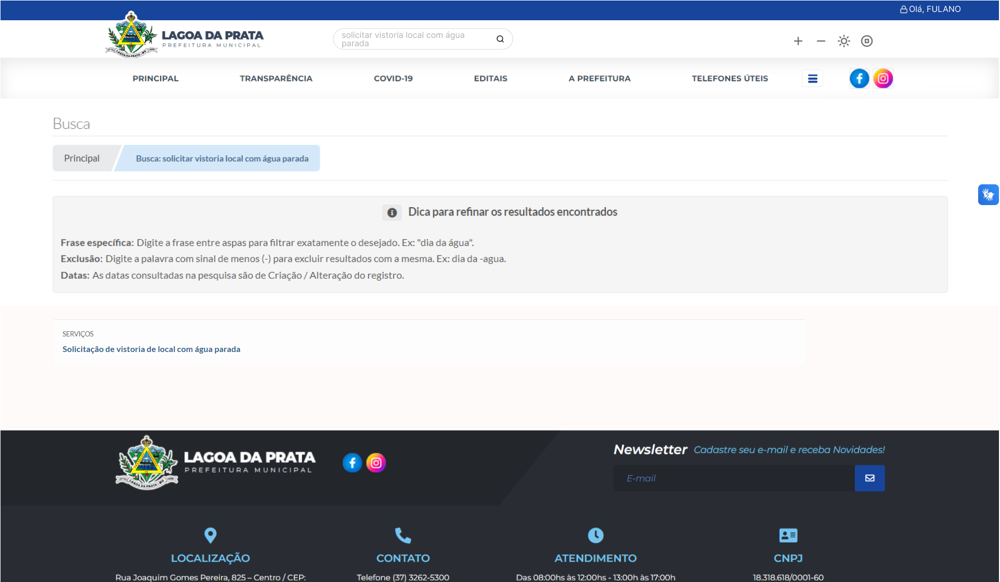

*Fonte: [DOURADO, Pedro Lucas](https://github.com/lucasdray). 2024.*

### 2.2 - Acessar página de solicitação pelo menu hamburguer
Abaixo se encontra a tela do protótipo após passar o mouse em cima do menu hamburguer encontrado na figura 04 a seguir.

**Figura 04** - Acessar página de solicitação pelo menu hamburguer

*Fonte: [DOURADO, Pedro Lucas](https://github.com/lucasdray). 2024.*

### 2.3 - Acessar página de solicitação pelo "Serviços para cidadão"
Abaixo se encontra a tela do protótipo após clicar no botão de "Serviços para cidadão na homepage encontrada na figura 05.

**Figura 05** - Acessar página de solicitação pelo menu hamburguer

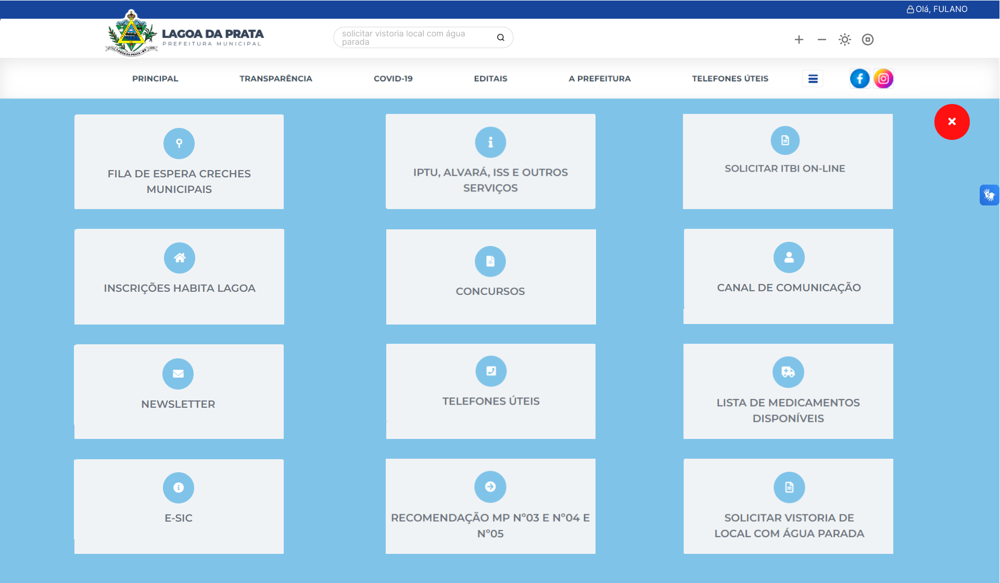

*Fonte: [DOURADO, Pedro Lucas](https://github.com/lucasdray). 2024.*

### 3.1 e 3.2 - Acessar página de solicitação pelo "Serviços para cidadão"
Abaixo se encontra a tela do protótipo de informação da solicitação na figura 06.

**Figura 06** - Página Informação  

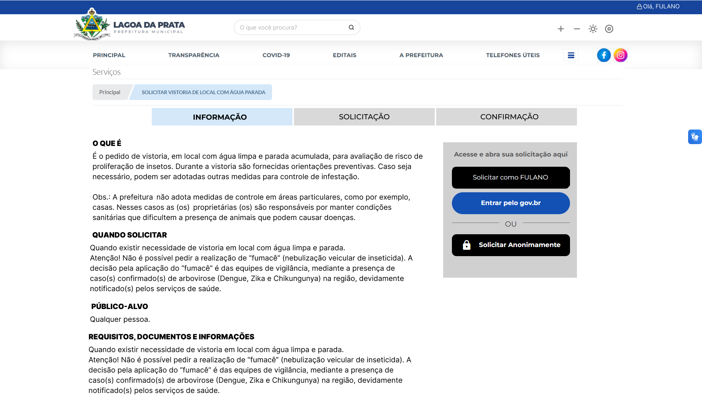

*Fonte: [DOURADO, Pedro Lucas](https://github.com/lucasdray). 2024.*

### 4 - Acessar página do formulário de solicitação, preencher e enviar
Abaixo se encontra a tela do protótipo do formulário da solicitação na figura 07 e na figura 08 se encontra a tela do protótipo do formulário da solicitação com os dados preenchidos.

**Figura 07** - Página Solicitação  

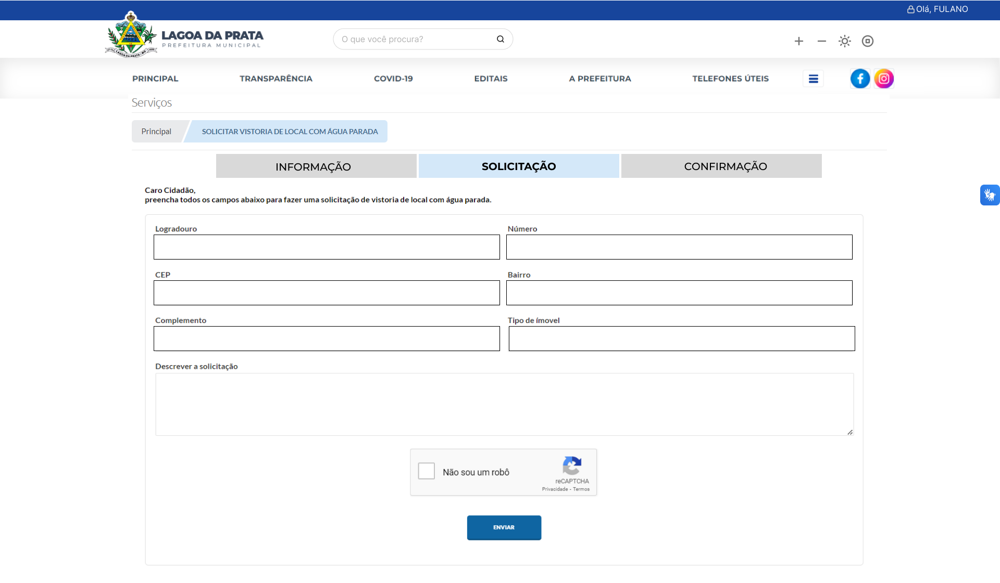

*Fonte: [DOURADO, Pedro Lucas](https://github.com/lucasdray). 2024.*

**Figura 08** - Página Solicitação preenchida

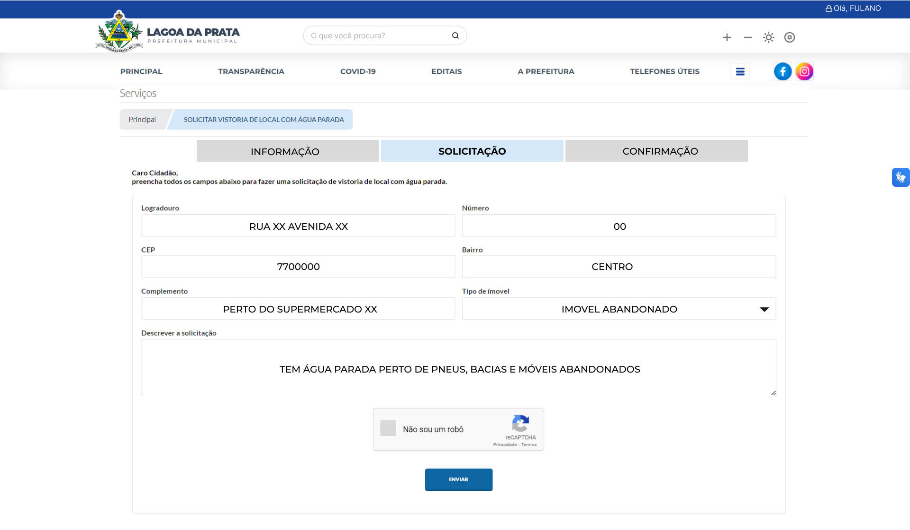

*Fonte: [DOURADO, Pedro Lucas](https://github.com/lucasdray). 2024.*

Abaixo se encontra a figura 09 referente a página de confirmação que a solicitação foi enviada.

**Figura 09** - Página confirmação

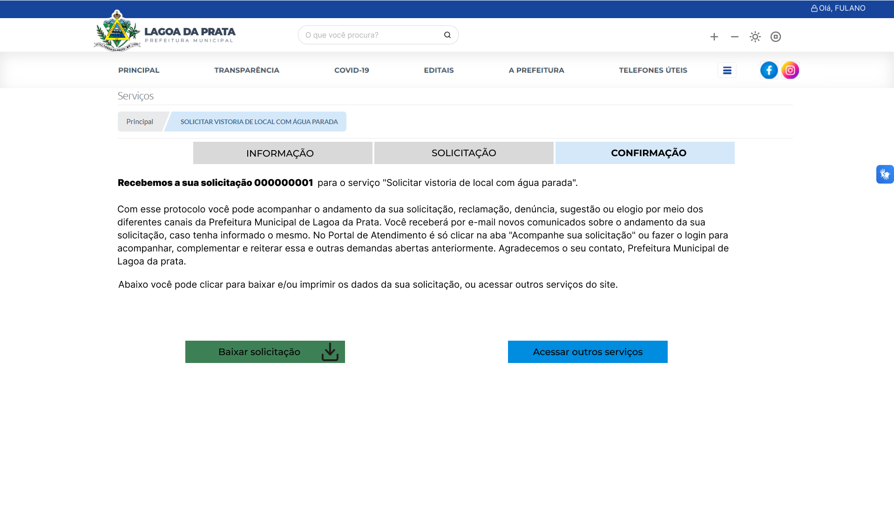

*Fonte: [DOURADO, Pedro Lucas](https://github.com/lucasdray). 2024.*

## Teste Piloto
Após concluir o planejamento da avaliação e antes de realmente fazer os testes de usabilidades, entrevista e questionários aos usuários-alvo foi realizado o teste piloto do protótipo de alta fidelidade da tárefa descrita neste artefato, como foi pontuado no livro Interação Humano Computador . Sendo o mesmo realizado pelo integrante do grupo 05 [Pedro Lucas](https://github.com/lucasdray) como entrevistador e a integrante do grupo [Joyce Dionizio](https://github.com/joycejdm.png) como entrevistada/usuário-alvo. Logo abaixo se encontra a tabela 01 contendo os dados com relação a gravação do teste piloto.

**Tabela 1** - Cronograma da Execução do Teste Piloto 

| Ordem | Data       | Horário de início e fim | Local                       | Entrevistadores                                    | Entrevistado                                      | Tarefas                                           |
| ----- | ---------- | ----------------------- | --------------------------- | -------------------------------------------------- | ------------------------------------------------- | ------------------------------------------------- |
| 1°    | 02/07/2025 | 20:15 - 21:25           | Residência do entrevistador | [Pedro Lucas Dourado](https://github.com/freitasc) | [Joyce Dionizio](https://github.com/joycejdm.png) | Solicitação de vistoria de local com água parada. |

 *Fonte: [DOURADO, Pedro Lucas](https://github.com/lucasdray). 2024.*

Logo abaixo se encontra o vídeo 01 que contém a gravação do teste piloto e que também pode ser acessado [clicando aqui][https://www.youtube.com/watch?v=z--mEMYEACU]:

**Vídeo 01** - Teste Piloto Tarefa Solicita vistoria de local com água parada

<iframe width="560" height="315" src="https://www.youtube.com/embed/z--mEMYEACU?si=8kgwGTXIhoONT8v-" title="YouTube video player" frameborder="0" allow="accelerometer; autoplay; clipboard-write; encrypted-media; gyroscope; picture-in-picture; web-share" referrerpolicy="strict-origin-when-cross-origin" allowfullscreen></iframe>

*Fonte: [DOURADO, Pedro Lucas](https://github.com/lucasdray). 2024.*

Abaixo na tabela 03 encontra as respostas do entrevistado adquiridas através do questionário realizado após o teste de usabilidade.

**Tabela 03** - Questiónario aplicado pós teste de usabilidade

| ID  | Pergunta                                                            | Resposta do entrevistado | Justificativa                 |
| --- | ------------------------------------------------------------------- | ------------------------ | ----------------------------- |
| 1   | A interface apresentada foi de fácil utilização?                    | SIM                      | -                             |
| 2   | Existe uma correspondência com a realidade ao realizar essas ações? | SIM                      | -                             |
| 3   | Teve algum problema com a disposição dos elementos na tela?         | NÃO                      | Estão bem dispostos           |
| 4   | Teve alguma dificuldade ao realizar as tarefas designadas?          | NÃO                      | Foi bem tranquilo de realizar |
| 5   | Teve de lidar com algum erro durante a utilização do sistema?       | NÃO                      | -                             |

*Fonte: Página: 266,Capítulo 11. Processos de Design de IHC. Livro: Barbosa, S. D. J.; Silva, B. S. da; Silveira, M. S.; Gasparini, I.; Darin, T.; Barbosa, G. D. J. (2021) Interação Humano-Computador e Experiência do usuário. Autopublicação.*

Logo após ser feita a gravação do teste piloto e por ter a falta de um avaliador disponível na hora da gravação, a avaliação foi realizada pelo entrevistador posteriormente revisando o vídeo gravado e o resultado da avaliação pode ser vista na tabela 04 a seguir.

**Tabela 04** - Perguntas para o avaliador

| ID  | Pergunta                                                                                     | Tipo de Resposta                                                        | Justificativa                                                                                         |
| --- | -------------------------------------------------------------------------------------------- | ----------------------------------------------------------------------- | ----------------------------------------------------------------------------------------------------- |
| 6   | O usuário conseguiu operar o sistema?                                                        | SIM                                                                     | -                                                                                                     |
| 7   | Ele atinge seu objetivo? Com quanta eficiência? Em quanto tempo? Após cometer quantos erros? | SIM   100% DE EFICIÊNCIA    em 00:35 minutos   0 ERROS COMETIDOS | Usuário  já possuia experiência com o site de Prefeituras e da Prefeitura Municipal de Lagoa da Prata |
| 8   | Ele entendeu o que deveria ser feito em seguida?                                             | SIM                                                                     | -                                                                                                     |
| 9   | Quais barreiras o usuário encontrou ao atingir seus objetivos?                               | NENHUMA                                                                 | -                                                                                                     |
| 10  | Quantas vezes os usuários consultaram a ajuda para realizar uma ação?                        | NENHUMA                                                                 | -                                                                                                     |

*Fonte: Página: 266,Capítulo 11. Processos de Design de IHC. Livro: Barbosa, S. D. J.; Silva, B. S. da; Silveira, M. S.; Gasparini, I.; Darin, T.; Barbosa, G. D. J. (2021) Interação Humano-Computador e Experiência do usuário. Autopublicação.*

### Considerações Finais 
Por não encontrar nenhum problema na utilização do protótipo de alta fidelidade considera-se que o protótipo esteja pronto para a realização do teste de usabilidade com usuários-alvos os quais estão sendo relatados a seguir.

## Teste de Usabilidades
A seguir será destrinchado melhor como foi feita a seleção dos participantes como os locais e datas que ocorreram o teste de usabilidade assim como as ferramentas utilizadas e uma breve descrição dos testes.

### Seleção dos Participantes, Local e Datas
O número de participantes foram 6, sendo 5 entrevistados e 1 entrevistado. A escolha desses usuários foi feita baseando-se nas características definidas no [perfil do usuário](../../requisitos1/perfil-do-usuario.md), sendo elas: idade entre 20 e 40 anos, experiência e afinidade com tecnologias e tarefas primárias de reportar um local com água parada. Como dito anteriormente a escolha da quantidade de usuários que participariam das entrevistas se deu por conta da recomendação de Dumas e Redish[2] de usar entre 5 e 12 usuários e da recomendação de Nielsen[3] que diz que 5 usuários já é o suficiente para detectar 85% dos problemas.

Abaixo se encontra a tabela 05 que mostra o cronograma da execução das entrevistas

**Tabela 05** - Cronograma executado de entrevistas

| Ordem | Data       | Horário de início e fim | Local                 | Entrevistador                                       | Entrevistado     | Tarefa                                            |
| ----- | ---------- | ----------------------- | --------------------- | --------------------------------------------------- | ---------------- | ------------------------------------------------- |
| 1°    | 03/07/2024 | 16:00 - 16:06           | FGA - LDTEA, sala 308 | [Pedro Lucas Dourado](https://github.com/lucasdray) | Felipe Verissimo | Solicitação de vistoria de local com água parada. |
| 2°    | 03/07/2024 | 16:09 - 16:18           | FGA - LDTEA, sala 308 | [Pedro Lucas Dourado](https://github.com/lucasdray) | Felipe Luís      | Solicitação de vistoria de local com água parada. |
| 3°    | 03/07/2024 | 16:45 - 16:54           | FGA - LDTEA, sala 308 | [Pedro Lucas Dourado](https://github.com/lucasdray) | Vinicius         | Solicitação de vistoria de local com água parada. |
| 4°    | 03/07/2024 | 17:04 - 17:09           | FGA - LDTEA, sala 308 | [Pedro Lucas Dourado](https://github.com/lucasdray) | Igor             | Solicitação de vistoria de local com água parada. |
| 5°    | 03/07/2024 | 17:13 - 17:17           | FGA - LDTEA, sala 308 | [Pedro Lucas Dourado](https://github.com/lucasdray) | João Vitor       | Solicitação de vistoria de local com água parada. |

 *Fonte: [DOURADO, Pedro Lucas](https://github.com/lucasdray). 2024.*

Por conta de não haver avaliadores disponíveis para fazer a avaliação enquanto a entrevista e gravação acontecia, a mesma foi realizada posterior a gravação pelo entrevistador.

### Ferramentas utilizadas
As seguintes ferramentas foram utilizadas durante as gravações do teste de usabilidade:

- Um notebook com webcam e microfone;
- Um papel contendo o script a ser seguido pelos usuários;
- Um smartphone contendo as tarefas e perguntas a serem respondidas após a entrevista.

### Descrição dos Testes
Antes de se iniciar os teste foi apresentado ao usuário-alvo um script contendo as ações e opções que o entrevistado iria realizar no protótipo. Assim como foi instruído como proceder em relação as abstrações utilizadas na parte de realizar login, preencher formulário e realizar o reCaptcha.
O teste em si inicia com apresentação do integrante do grupo, a leitura rápida do [termo de consetimento](../../requisitos1/aspectos-eticos.md#tcle-de-avaliação) e verbalização do usuário em concordar com o mesmo. Foi instruído que o usuário relatasse tudo que estava fazendo e pensando utilizando a técnica de think aloud [5] e logo em seguida o teste começou na "Homepage" do protótipo realizando a tarefa de "Solicitar vistoria de local com água parada".

### Planejamento do Reprojeto
Como a cada entrevista e teste de usabilidade os defeitos que foram encontrados pelos usuários-alvo entrevistados foram corrigidos, portanto há necessidade de planejamento do reprojeto. Entretanto após a apresentação dessa etapa o reprojeto possa ser válido de acordo com os pontos levantados pelo professor.

## Teste de Usabilidade 01

Abaixo se encontra a tabela 07 que mostra o cronograma da execução da primeira entrevista, contendo a data, horário, local, entrevistado, entrevistado e a tarefa testada.

**Tabela 07** - Cronograma executado de entrevistas

| Ordem | Data       | Horário de início e fim | Local                 | Entrevistador                                     | Entrevistado     | Tarefa                                            |
| ----- | ---------- | ----------------------- | --------------------- | --------------------------------------------------- | ---------------- | ------------------------------------------------- |
| 1°    | 03/07/2024 | 16:00 - 16:06           | FGA - LDTEA, sala 308 | [Pedro Lucas Dourado](https://github.com/lucasdray) | Felipe Verissimo | Solicitação de vistoria de local com água parada. |

 *Fonte: [DOURADO, Pedro Lucas](https://github.com/lucasdray). 2024.*

Logo abaixo se encontra o vídeo 02 que contém a gravação do teste de usabilidade 01 e que também pode ser acessado [clicando aqui][https://youtu.be/-0p9y3cgT_I].
Infelizmente o áudio do vídeo foi corrompido mas como as anotações (feedbacks, perguntas respondidas e avaliação do avaliador) foram feitas logo após a gravação do teste de usabilidade não foi necessário refazer o teste.

**Vídeo 02** - Teste de Usabilidade 01 - Felipe Verissimo

<iframe width="560" height="315" src="https://www.youtube.com/embed/-0p9y3cgT_I?si=oIEtPI9WJcSpkxF3" title="YouTube video player" frameborder="0" allow="accelerometer; autoplay; clipboard-write; encrypted-media; gyroscope; picture-in-picture; web-share" referrerpolicy="strict-origin-when-cross-origin" allowfullscreen></iframe>

*Fonte: [DOURADO, Pedro Lucas](https://github.com/lucasdray). 2024.*

Abaixo na tabela 08 encontra as respostas do entrevistado adquiridas através do questionário realizado após o teste de usabilidade.

**Tabela 08** - Questiónario aplicado pós teste de usabilidade do teste de usabilidade 01

| ID  | Pergunta                                                            | Resposta do entrevistado | Justificativa                                                                                            |
| --- | ------------------------------------------------------------------- | ------------------------ | -------------------------------------------------------------------------------------------------------- |
| 1   | A interface apresentada foi de fácil utilização?                    | SIM                      | -                                                                                                        |
| 2   | Existe uma correspondência com a realidade ao realizar essas ações? | SIM                      | Sim e acredito que um usuário comum poderia facilmente realizar a tárefa utilizando o fluxo que utilizei |
| 3   | Teve algum problema com a disposição dos elementos na tela?         | NAO                      | Não, não tive nenhum problema e acredito que esteja bem responsivoa                                      |
| 4   | Teve alguma dificuldade ao realizar as tarefas designadas?          | NÃO                      | -                                                                                                        |
| 5   | Teve de lidar com algum erro durante a utilização do sistema?       | NÃO                      | -                                                                                                        |

*Fonte: Página: 266,Capítulo 11. Processos de Design de IHC. Livro: Barbosa, S. D. J.; Silva, B. S. da; Silveira, M. S.; Gasparini, I.; Darin, T.; Barbosa, G. D. J. (2021) Interação Humano-Computador e Experiência do usuário. Autopublicação.*

Logo após ser feita a gravação do teste de usabilidade e por ter a falta de um avaliador disponível na hora da gravação, a avaliação foi realizada pelo entrevistador posteriormente revisando o vídeo gravado e o resultado da avaliação pode ser vista na tabela 09 a seguir.

**Tabela 09** - Perguntas para o avaliador sobre teste de usabilidade 01

| ID  | Pergunta                                                                                     | Tipo de Resposta                                                                                                                | Observação |
| --- | -------------------------------------------------------------------------------------------- | ------------------------------------------------------------------------------------------------------------------------------- | ---------- |
| 6   | O usuário conseguiu operar o sistema?                                                        | SIM                                                                                                                             | -          |
| 7   | Ele atinge seu objetivo? Com quanta eficiência? Em quanto tempo? Após cometer quantos erros? | SIM   100% DE EFICIÊNCIA    em 0:52 minutos   0 ERROS COMETIDOS                                                        | -          |
| 8   | Ele entendeu o que deveria ser feito em seguida?                                             | SIM                                                                                                                             | -          |
| 9   | Quais barreiras o usuário encontrou ao atingir seus objetivos?                               | Apenas um problema de implementação do Figma em que ele não estava conseguindo descer a página depois de preecnher o formulário | -          |
| 10  | Quantas vezes os usuários consultaram a ajuda para realizar uma ação?                        | NENHUMA                                                                                                                         | -          |

*Fonte: Página: 266,Capítulo 11. Processos de Design de IHC. Livro: Barbosa, S. D. J.; Silva, B. S. da; Silveira, M. S.; Gasparini, I.; Darin, T.; Barbosa, G. D. J. (2021) Interação Humano-Computador e Experiência do usuário. Autopublicação.*

### Problemas Encontrados

#### ID 9 - Quais barreiras o usuário encontrou ao atingir seus objetivos?  
- Foi encontrado um problema em que ao clicar pra preencher o formulário e tentar descer ou subir a pagina com o ponteiro do mouse em cima do formulário preenchido, a ação não funcionava. Isso se dava por uma limitação da escolha de implementação realizada no Figma[4] e que posteriormente foi corrigido no teste de usabilidade 03. Conforme mostra a figura 10 a seguir ou entre os minutos 2:51 e 2:58 do vídeo 02 mostrado anteriormente.

**Figura 10** - Problema relacionado ao ID 9

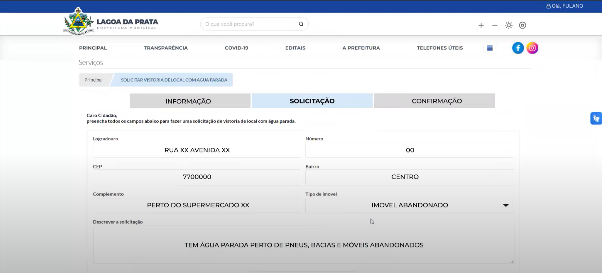

*Fonte: [DOURADO, Pedro Lucas](https://github.com/lucasdray). 2024.*

A tabela 10 abaixo resume a avaliação do problema encontrado

**Tabela 10** - Perguntas para o avaliador

| Item de Análise                      | Descrição                                                                                        |
| ------------------------------------ | ------------------------------------------------------------------------------------------------ |
| Local:                               | Página Solicitação Preenchida                                                                    |
| Descrição:                           | O usuário após clicar para preencher o formulário tenta descer ou subir a página e não consegue. |
| Justificativa:                       | Implementação realizada no Figma de forma errada                                                 |
| Ação Realizada pelo Usuário:         | Moveu o scroll do mouse para baixo                                                               |
| Resposta do Sistema Esperada:        | Descer a página                                                                                  |
| Resposta apresentada pelo Sistema:   | Nada acontece                                                                                    |
| Fatores de Usabilidade Prejudicados: | Eficiência                                                                                       |

*Fonte: Página: 319,Capítulo 12. Avaliação de IHC através de Observação. Livro: Barbosa, S. D. J.; Silva, B. S. da; Silveira, M. S.; Gasparini, I.; Darin, T.; Barbosa, G. D. J. (2021) Interação Humano-Computador e Experiência do usuário. Autopublicação.*

### Planejamento para reprojeto
Para a reprojeto, as correções deviam ser realizadas de acordo com os problemas encontrados anteriormente e antes da próxima gravação do teste de usabilidade 02, entretanto, o mesmo não foi feito sendo realizado apenas após a gravação do teste de usabilidade 02.

## Teste de Usabilidade 02
Abaixo se encontra a tabela 11 que mostra o cronograma da execução da primeira entrevista, contendo a data, horário, local, entrevistado, entrevistado e a tarefa testada.

**Tabela 11** - Cronograma executado de entrevistas

| Ordem | Data       | Horário de início e fim | Local                 | Entrevistador                                     | Entrevistado     | Tarefa                                            |
| ----- | ---------- | ----------------------- | --------------------- | --------------------------------------------------- | ---------------- | ------------------------------------------------- |
| 2°    | 03/07/2024 | 16:09 - 16:18           | FGA - LDTEA, sala 308 | [Pedro Lucas Dourado](https://github.com/lucasdray) | Felipe Luís      | Solicitação de vistoria de local com água parada. |

 *Fonte: [DOURADO, Pedro Lucas](https://github.com/lucasdray). 2024.*

Logo abaixo se encontra o vídeo 03 que contém a gravação do teste de usabilidade 02 e que também pode ser acessado [clicando aqui](https://youtu.be/Q2ym7eqnwQs?si=svwxIeMUcd3PtM1G).

Infelizmente o áudio do vídeo foi corrompido mas como as anotações (feedbacks, perguntas respondidas e avaliação do avaliador) foram feitas logo após a gravação do teste de usabilidade não foi necessário refazer o teste.

**Vídeo 03** - Teste de Usabilidade 02 - Felipe Luis

<iframe width="560" height="315" src="https://www.youtube.com/embed/Q2ym7eqnwQs?si=dFADCC2iMVpbOcxF" title="YouTube video player" frameborder="0" allow="accelerometer; autoplay; clipboard-write; encrypted-media; gyroscope; picture-in-picture; web-share" referrerpolicy="strict-origin-when-cross-origin" allowfullscreen></iframe>

*Fonte: [DOURADO, Pedro Lucas](https://github.com/lucasdray). 2024.*

Abaixo na tabela 12 encontra as respostas do entrevistado adquiridas através do questionário realizado após o teste de usabilidade.

**Tabela 12** - Questiónario aplicado pós teste de usabilidade do teste de usabilidade 02

| ID  | Pergunta                                                            | Resposta do entrevistado | Justificativa                                                                                                                                                                      |
| --- | ------------------------------------------------------------------- | ------------------------ | ---------------------------------------------------------------------------------------------------------------------------------------------------------------------------------- |
| 1   | A interface apresentada foi de fácil utilização?                    | SIM                      | Pois além de textos os botões possuem ícones que facilitam a utilização do usuário                                                                                                 |
| 2   | Existe uma correspondência com a realidade ao realizar essas ações? | SIM                      | Acredito que facilmente um usuário médio do sistema conseguiria realizar as ações que realizei, embora tenha o problema de localizar o serviço                                     |
| 3   | Teve algum problema com a disposição dos elementos na tela?         | SIM                      | Tive uma certa dificuldade de acessar o serviço na aba de menu hambúrguer por ela possuir "Serviços" e "Serviços Online" e isos acabou me confundindo e dificultando a localização |
| 4   | Teve alguma dificuldade ao realizar as tarefas designadas?          | NÃO                      | Foi bem tranquilo                                                                                                                                                                  |
| 5   | Teve de lidar com algum erro durante a utilização do sistema?       | NÃO                      | Sem erros                                                                                                                                                                          |

*Fonte: Página: 266,Capítulo 11. Processos de Design de IHC. Livro: Barbosa, S. D. J.; Silva, B. S. da; Silveira, M. S.; Gasparini, I.; Darin, T.; Barbosa, G. D. J. (2021) Interação Humano-Computador e Experiência do usuário. Autopublicação.*

Logo após ser feita a gravação do teste de usabilidade e por ter a falta de um avaliador disponível na hora da gravação, a avaliação foi realizada pelo entrevistador posteriormente revisando o vídeo gravado e o resultado da avaliação pode ser vista na tabela 13 a seguir.

**Tabela 13** - Perguntas para o avaliador do teste de usabilidade 02

| ID  | Pergunta                                                                                     | Tipo de Resposta                                                                                                                                 | Observação                                                                                                                                                                                                                                                                            |
| --- | -------------------------------------------------------------------------------------------- | ------------------------------------------------------------------------------------------------------------------------------------------------ | ------------------------------------------------------------------------------------------------------------------------------------------------------------------------------------------------------------------------------------------------------------------------------------- |
| 6   | O usuário conseguiu operar o sistema?                                                        | SIM                                                                                                                                              | -                                                                                                                                                                                                                                                                                     |
| 7   | Ele atinge seu objetivo? Com quanta eficiência? Em quanto tempo? Após cometer quantos erros? | SIM   Com um pequeno problema quanto a localizar o serviço da tarefa testada no menu hamrbúrguer    EM 2:32 minutos   0 ERROS COMETIDOS | Apesar de não cometer erro ele teve dificuldades em localizar o serviço na aba de "Serviços Online" confundindo pois existia outra aba "Serviços", o tempo de uso para realizar a atividade foi maior pois o usuário ia passando o feedback em tempo real após cada tomada de decisão |
| 8   | Ele entendeu o que deveria ser feito em seguida?                                             | SIM                                                                                                                                              | -                                                                                                                                                                                                                                                                                     |
| 9   | Quais barreiras o usuário encontrou ao atingir seus objetivos?                               | Apenas um problema de implementação do Figma em que ele não estava conseguindo descer a página depois de preecnher o formulário                  | Embora no teste anterior esse problema tenha sido identificado não foi feito a correção para esse teste de usabilidade, sendo feito para o proximo                                                                                                                                                                                                                                                                                     |
| 10  | Quantas vezes os usuários consultaram a ajuda para realizar uma ação?                        | NENHUMA                                                                                                                                          | -                                                                                                                                                                                                                                                                                     |

*Fonte: Página: 266,Capítulo 11. Processos de Design de IHC. Livro: Barbosa, S. D. J.; Silva, B. S. da; Silveira, M. S.; Gasparini, I.; Darin, T.; Barbosa, G. D. J. (2021) Interação Humano-Computador e Experiência do usuário. Autopublicação.*

### Problemas Encontrados

#### ID 3 - Teve algum problema com a disposição dos elementos na tela?
#### ID 7 - Ele atinge seu objetivo? Com quanta eficiência? Em quanto tempo? Após cometer quantos erros?
Como os problemas são os mesmos foi juntado as perguntas

- Dificil percepção do usuário para localizar o serviço "Solicitar vistoria de local com água parada" no menu hambúrguer por conter as abas "Serviços" e "Serviços Online", como apontado na figura 11 aseguir

**Figura 11** - Problema relacionado ao ID 3 e 7

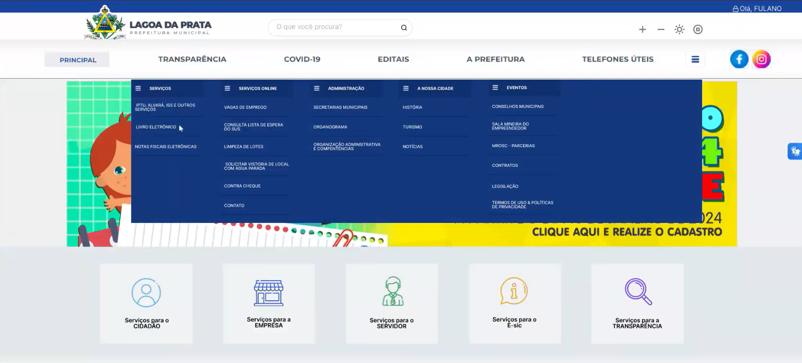

*Fonte: [DOURADO, Pedro Lucas](https://github.com/lucasdray). 2024.*

#### ID 9 - Quais barreiras o usuário encontrou ao atingir seus objetivos?  
- Foi encontrado um problema em que ao clicar pra preencher o formulário e tentar descer ou subir a pagina com o ponteiro do mouse em cima do formulário preenchido, a ação não funcionava. Isso se dava por uma limitação da escolha de implementação realizada no Figma[4] e que posteriormente foi corrigido no teste de usabilidade 03. Conforme mostra nos minutos 3:48 e 3:58 do vídeo 03 mostrado anteriormente.

### Planejamento para reprojeto
Para a reprojeto, as correções que foram realizadas estão de acordo com os problemas encontrados anteriormente com relação ao ID 3, 7 e 9. Que foram trabalhados e integrados ao protótipo de alta fidelidade antes da proxima gravação do teste de usabilidade.

A figura 12 a seguir mostra a correção feita com relação ao menu hambúrguer em que foi trocado o termo "Serviços Online" para "Solicitação de Serviços".

**Figura 12** - Menu Hambúrguer corrigido

*Fonte: [DOURADO, Pedro Lucas](https://github.com/lucasdray). 2024.*

No testes de usabilidades seguintes o objetivo era de comparar ideias e alternativas de design para ver se a mudança realizada era realmente válida, entretanto, essa comparação não foi realizada em nenhum teste de usabilidade.

## Teste de Usabilidade 03
Abaixo se encontra a tabela 14 que mostra o cronograma da execução da primeira entrevista, contendo a data, horário, local, entrevistado, entrevistado e a tarefa testada.

**Tabela 14** - Cronograma executado de entrevistas

| Ordem | Data       | Horário de início e fim | Local                 | Entrevistador                                     | Entrevistado     | Tarefa                                            |
| ----- | ---------- | ----------------------- | --------------------- | --------------------------------------------------- | ---------------- | ------------------------------------------------- |
| 3°    | 03/07/2024 | 16:45 - 16:54           | FGA - LDTEA, sala 308 | [Pedro Lucas Dourado](https://github.com/lucasdray) | Igor             | Solicitação de vistoria de local com água parada. |

 *Fonte: [DOURADO, Pedro Lucas](https://github.com/lucasdray). 2024.*

Logo abaixo se encontra o vídeo 04 que contém a gravação do teste de usabilidade 03 e que também pode ser acessado [clicando aqui](https://www.youtube.com/watch?v=TKJ-K83-adA).

Infelizmente o áudio do vídeo foi corrompido mas como as anotações (feedbacks, perguntas respondidas e avaliação do avaliador) foram feitas logo após a gravação do teste de usabilidade não foi necessário refazer o teste.

**Vídeo 04** - Teste de Usabilidade 03 - Vinicius

<iframe width="560" height="315" src="https://www.youtube.com/embed/TKJ-K83-adA?si=-4uTGFHMHAtzuWiM" title="YouTube video player" frameborder="0" allow="accelerometer; autoplay; clipboard-write; encrypted-media; gyroscope; picture-in-picture; web-share" referrerpolicy="strict-origin-when-cross-origin" allowfullscreen></iframe>

*Fonte: [DOURADO, Pedro Lucas](https://github.com/lucasdray). 2024.*

Abaixo na tabela 15 encontra as respostas do entrevistado adquiridas através do questionário realizado após o teste de usabilidade.

**Tabela 15** - Questiónario aplicado pós teste de usabilidade do teste de usabilidade 03

| ID  | Pergunta                                                            | Resposta do entrevistado | Justificativa                                                                                                                                |
| --- | ------------------------------------------------------------------- | ------------------------ | -------------------------------------------------------------------------------------------------------------------------------------------- |
| 1   | A interface apresentada foi de fácil utilização?                    | SIM                      | Acredito que sim, embora eu tenha tido uma dificuldade no começo em relação ao botão login mas acredito que tenha sido um problema meu mesmo |
| 2   | Existe uma correspondência com a realidade ao realizar essas ações? | SIM                      | Com certeza ta bem intuitivo                                                                                                                 |
| 3   | Teve algum problema com a disposição dos elementos na tela?         | NÃO                      | Achei tranquilo o jeito que estão dispostos                                                                                                  |
| 4   | Teve alguma dificuldade ao realizar as tarefas designadas?          | NÃO                      | -                                                                                                                                            |
| 5   | Teve de lidar com algum erro durante a utilização do sistema?       | NÃO                      | Sem erros                                                                                                                                    |

*Fonte: Página: 266,Capítulo 11. Processos de Design de IHC. Livro: Barbosa, S. D. J.; Silva, B. S. da; Silveira, M. S.; Gasparini, I.; Darin, T.; Barbosa, G. D. J. (2021) Interação Humano-Computador e Experiência do usuário. Autopublicação.*

Logo após ser feita a gravação do teste de usabilidade e por ter a falta de um avaliador disponível na hora da gravação, a avaliação foi realizada pelo entrevistador posteriormente revisando o vídeo gravado e o resultado da avaliação pode ser vista na tabela 16 a seguir.

**Tabela 16** - Perguntas para o avaliador do teste de usabilidade 03

| ID  | Pergunta                                                                                     | Tipo de Resposta                                                                                                         | Observação                                                                                                                                                                                                     |
| --- | -------------------------------------------------------------------------------------------- | ------------------------------------------------------------------------------------------------------------------------ | -------------------------------------------------------------------------------------------------------------------------------------------------------------------------------------------------------------- |
| 6   | O usuário conseguiu operar o sistema?                                                        | SIM                                                                                                                      | -                                                                                                                                                                                                              |
| 7   | Ele atinge seu objetivo? Com quanta eficiência? Em quanto tempo? Após cometer quantos erros? | SIM   Não foi tão eficiente em comparação aos outros usuários observados    EM 2:08 minutos   4 ERROS COMETIDOS | Erro ao clicar no botão login;   Erro ao prosseguir com a solicitação estando na tela de informação da solicitação, clicando no botão de busca, tentando acessar o menu hambúrguer depois voltando pra home |
| 8   | Ele entendeu o que deveria ser feito em seguida?                                             | NÃO                                                                                                                      | Teve dificuldade em fazer realmente a solicitação                                                                                                                                                              |
| 9   | Quais barreiras o usuário encontrou ao atingir seus objetivos?                               | Localizar o botão para realizar login; Localizar como prosseguir com a solitação na página de informação da solicitação  | Usuário estava mais tentando fazer por tentativa e erro do que realmente analisando onde clicar para prosseguir e realizar a tárefa                                                                            |
| 10  | Quantas vezes os usuários consultaram a ajuda para realizar uma ação?                        | 6 vezes                                                                                                                  | Basicamente a cada etapa do script ele visualizava o papel do script para saber o que fazer em seguida em vez de seguir um fluxo de pensamento próprio                                                         |

*Fonte: Página: 266,Capítulo 11. Processos de Design de IHC. Livro: Barbosa, S. D. J.; Silva, B. S. da; Silveira, M. S.; Gasparini, I.; Darin, T.; Barbosa, G. D. J. (2021) Interação Humano-Computador e Experiência do usuário. Autopublicação.*

### Problemas Encontrados
Com base na observação e nas respsotas das perguntas com ID 1,7 e 9 das tabelas acima, os problemas encontrados foram:

- Botão login com pouco destaque para o usuário.
- Botão menu hambúrguer não funcionando corretamente em páginas além da home.

### Planejamento para reprojeto
Para a reprojeto, as correções que foram realizadas estão de acordo com os problemas encontrados anteriormente com relação ao ID 1, 7 e 9. Que foram trabalhados e integrados ao protótipo de alta fidelidade antes da proxima gravação do teste de usabilidade. 

A figura 13 a seguir mostra a correção feita com relação ao botão login que o usuário Vinicius reclamou de não haver um certo destaque.

**Figura 13** - Botão login destacado

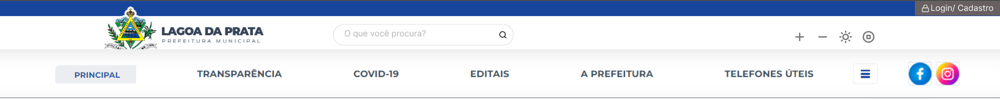

*Fonte: [DOURADO, Pedro Lucas](https://github.com/lucasdray). 2024.*

No testes de usabilidades seguintes o objetivo era de comparar ideias e alternativas de design para ver se a mudança realizada era realmente válida, entretanto, essa comparação não foi realizada em nenhum teste de usabilidade.

## Teste de Usabilidade 04
Abaixo se encontra a tabela 17 que mostra o cronograma da execução da primeira entrevista, contendo a data, horário, local, entrevistado, entrevistado e a tarefa testada.

**Tabela 17** - Cronograma executado de entrevistas

| Ordem | Data       | Horário de início e fim | Local                 | Entrevistador                                     | Entrevistado     | Tarefa                                            |
| ----- | ---------- | ----------------------- | --------------------- | --------------------------------------------------- | ---------------- | ------------------------------------------------- |
| 4°    | 03/07/2024 | 17:04 - 17:09           | FGA - LDTEA, sala 308 | [Pedro Lucas Dourado](https://github.com/lucasdray) | Igor             | Solicitação de vistoria de local com água parada. |

 *Fonte: [DOURADO, Pedro Lucas](https://github.com/lucasdray). 2024.*

Logo abaixo se encontra o vídeo 05 que contém a gravação do teste de usabilidade 04 e que também pode ser acessado [clicando aqui](https://www.youtube.com/watch?v=SPYwYdb16y8).

Infelizmente o áudio do vídeo foi corrompido mas como as anotações (feedbacks, perguntas respondidas e avaliação do avaliador) foram feitas logo após a gravação do teste de usabilidade não foi necessário refazer o teste.

**Vídeo 04** - Teste de Usabilidade 04 - Igor

<iframe width="560" height="315" src="https://www.youtube.com/embed/SPYwYdb16y8?si=no8sUVxUsyGEaRsn" title="YouTube video player" frameborder="0" allow="accelerometer; autoplay; clipboard-write; encrypted-media; gyroscope; picture-in-picture; web-share" referrerpolicy="strict-origin-when-cross-origin" allowfullscreen></iframe>

*Fonte: [DOURADO, Pedro Lucas](https://github.com/lucasdray). 2024.*

Abaixo na tabela 18 encontra as respostas do entrevistado adquiridas através do questionário realizado após o teste de usabilidade.

**Tabela 18** - Questiónario aplicado pós teste de usabilidade do teste de usabilidade 04

| ID  | Pergunta                                                            | Resposta do entrevistado | Justificativa                                        |
| --- | ------------------------------------------------------------------- | ------------------------ | ---------------------------------------------------- |
| 1   | A interface apresentada foi de fácil utilização?                    | SIM                      | Ta bem tranquilo a utilização do site                |
| 2   | Existe uma correspondência com a realidade ao realizar essas ações? | SIM                      | Um usuário leigo conseguiria realizar essa atividade |
| 3   | Teve algum problema com a disposição dos elementos na tela?         | NÃO                      | Achei tranquilo o jeito que estão dispostos          |
| 4   | Teve alguma dificuldade ao realizar as tarefas designadas?          | NÃO                      | foi bem tranquilo                                                    |
| 5   | Teve de lidar com algum erro durante a utilização do sistema?       | NÃO                      | Sem erros                                            |

*Fonte: Página: 266,Capítulo 11. Processos de Design de IHC. Livro: Barbosa, S. D. J.; Silva, B. S. da; Silveira, M. S.; Gasparini, I.; Darin, T.; Barbosa, G. D. J. (2021) Interação Humano-Computador e Experiência do usuário. Autopublicação.*

Logo após ser feita a gravação do teste de usabilidade e por ter a falta de um avaliador disponível na hora da gravação, a avaliação foi realizada pelo entrevistador posteriormente revisando o vídeo gravado e o resultado da avaliação pode ser vista na tabela 19 a seguir.

**Tabela 19** - Perguntas para o avaliador do teste de usabilidade 04

| ID  | Pergunta                                                                                     | Tipo de Resposta                                                     | Observação                                                 |
| --- | -------------------------------------------------------------------------------------------- | -------------------------------------------------------------------- | ---------------------------------------------------------- |
| 6   | O usuário conseguiu operar o sistema?                                                        | SIM                                                                  | -                                                          |
| 7   | Ele atinge seu objetivo? Com quanta eficiência? Em quanto tempo? Após cometer quantos erros? | SIM   100% EFICIENTE    EM 1:18 minutos   0 ERROS COMETIDOS | -                                                          |
| 8   | Ele entendeu o que deveria ser feito em seguida?                                             | SIM                                                                  | Teve dificuldade em fazer realmente a solicitação          |
| 9   | Quais barreiras o usuário encontrou ao atingir seus objetivos?                               | NENHUMA                                                              | -                                                          |
| 10  | Quantas vezes os usuários consultaram a ajuda para realizar uma ação?                        | 1 vez                                                                | Consultou apenas no começo para começar a realizar o teste |

*Fonte: Página: 266,Capítulo 11. Processos de Design de IHC. Livro: Barbosa, S. D. J.; Silva, B. S. da; Silveira, M. S.; Gasparini, I.; Darin, T.; Barbosa, G. D. J. (2021) Interação Humano-Computador e Experiência do usuário. Autopublicação.*

### Problemas Encontrados
Não foi encontrado nenhum problema de acordo com o teste de usabilidade 04.

## Teste de Usabilidade 05
Abaixo se encontra a tabela 20 que mostra o cronograma da execução da primeira entrevista, contendo a data, horário, local, entrevistado, entrevistado e a tarefa testada.

**Tabela 20** - Cronograma executado de entrevistas

| Ordem | Data       | Horário de início e fim | Local                 | Entrevistador                                     | Entrevistado     | Tarefa                                            |
| ----- | ---------- | ----------------------- | --------------------- | --------------------------------------------------- | ---------------- | ------------------------------------------------- |
| 5°    | 03/07/2024 | 17:13 - 17:17           | FGA - LDTEA, sala 308 | [Pedro Lucas Dourado](https://github.com/lucasdray) | João Vitor       | Solicitação de vistoria de local com água parada. |

 *Fonte: [DOURADO, Pedro Lucas](https://github.com/lucasdray). 2024.*

Logo abaixo se encontra o vídeo 06 que contém a gravação do teste de usabilidade 05 e que também pode ser acessado [clicando aqui](https://www.youtube.com/watch?v=C_c5Hp-P_Tw).

**Vídeo 04** - Teste de Usabilidade 05 - João Vitor

<iframe width="560" height="315" src="https://www.youtube.com/embed/SPYwYdb16y8?si=no8sUVxUsyGEaRsn" title="YouTube video player" frameborder="0" allow="accelerometer; autoplay; clipboard-write; encrypted-media; gyroscope; picture-in-picture; web-share" referrerpolicy="strict-origin-when-cross-origin" allowfullscreen></iframe>

*Fonte: [DOURADO, Pedro Lucas](https://github.com/lucasdray). 2024.*

Abaixo na tabela 21 encontra as respostas do entrevistado adquiridas através do questionário realizado após o teste de usabilidade.

**Tabela 21** - Questiónario aplicado pós teste de usabilidade do teste de usabilidade 05

| ID  | Pergunta                                                            | Resposta do entrevistado | Justificativa                                                          |
| --- | ------------------------------------------------------------------- | ------------------------ | ---------------------------------------------------------------------- |
| 1   | A interface apresentada foi de fácil utilização?                    | SIM                      | -                                                                      |
| 2   | Existe uma correspondência com a realidade ao realizar essas ações? | SIM                      | Um usuário leigo poderia sim seguir o fluxo de realização dessas ações |
| 3   | Teve algum problema com a disposição dos elementos na tela?         | NÃO                      | Ta tudo certinho                                                       |
| 4   | Teve alguma dificuldade ao realizar as tarefas designadas?          | NÃO                      | -                                                                      |
| 5   | Teve de lidar com algum erro durante a utilização do sistema?       | NÃO                      | Não teve erro                                                          |

*Fonte: Página: 266,Capítulo 11. Processos de Design de IHC. Livro: Barbosa, S. D. J.; Silva, B. S. da; Silveira, M. S.; Gasparini, I.; Darin, T.; Barbosa, G. D. J. (2021) Interação Humano-Computador e Experiência do usuário. Autopublicação.*

Logo após ser feita a gravação do teste de usabilidade e por ter a falta de um avaliador disponível na hora da gravação, a avaliação foi realizada pelo entrevistador posteriormente revisando o vídeo gravado e o resultado da avaliação pode ser vista na tabela 22 a seguir.

**Tabela 22** - Perguntas para o avaliador do teste de usabilidade 05

| ID  | Pergunta                                                                                     | Tipo de Resposta                                                     | Observação |
| --- | -------------------------------------------------------------------------------------------- | -------------------------------------------------------------------- | ---------- |
| 6   | O usuário conseguiu operar o sistema?                                                        | SIM                                                                  | -          |
| 7   | Ele atinge seu objetivo? Com quanta eficiência? Em quanto tempo? Após cometer quantos erros? | SIM   100% EFICIENTE    EM 0:26 minutos   0 ERROS COMETIDOS | -          |
| 8   | Ele entendeu o que deveria ser feito em seguida?                                             | SIM                                                                  | -          |
| 9   | Quais barreiras o usuário encontrou ao atingir seus objetivos?                               | NENHUMA                                                              | -          |
| 10  | Quantas vezes os usuários consultaram a ajuda para realizar uma ação?                        | NENHUMA                                                              | -          |

*Fonte: Página: 266,Capítulo 11. Processos de Design de IHC. Livro: Barbosa, S. D. J.; Silva, B. S. da; Silveira, M. S.; Gasparini, I.; Darin, T.; Barbosa, G. D. J. (2021) Interação Humano-Computador e Experiência do usuário. Autopublicação.*

### Problemas Encontrados
Não foi encontrado nenhum problema de acordo com o teste de usabilidade 05.

## Consolidação de dados coletados
Após uma análise dos dados coletados de todos os testes de usabilidades apresentados foi possível fazer uma tabela comparativa para uma, a tabela 23 a seguir mostra o tempo necessário para realizar a tarefa, a quantidade de erros cometeidos e a quantidade de consulta que o usuário teve para realizar a ação de acordo com cada teste de usabilidade realizado. 

**Tabela 23** - Dados coletados dos testes

| Teste de Usabilidade | Tempo necessário para realizar tarefa em minutos | Erros cometidos | Quantidade de consulta de ajuda para realizar ação |
| -------------------- | ------------------------------------------------ | --------------- | -------------------------------------------------- |
| 01                   | 0:52                                             | 0               | 0                                                  |
| 02                   | 2:32                                             | 0               | 0                                                  |
| 03                   | 2:08                                             | 4               | 6                                                  |
| 04                   | 1:18                                             | 0               | 1                                                  |
| 05                   | 0:26                                             | 0               | 0                                                  |
| Média                | 1:27                                             | 0,8             | 1,4                                                |

*Fonte: [DOURADO, Pedro Lucas](https://github.com/lucasdray). 2024.*

## Bibliografia

> [1] Barbosa, S. D. J.; Silva, B. S. da; Silveira, M. S.; Gasparini, I.; Darin, T.; Barbosa, G. D. J. (2021) Interação Humano-Computador e Experiência do usuário. Autopublicação.

> [2] Dumas, J. S., & Redish, J. C. (1999). A practical guide to usability testing. Intellect Books.

> [3] NIELSEN, Jakob. Usability Engineering. Academic Press, 1993.

> [4] FIGMA. Disponivel em: https://www.figma.com Acesso em: 03 de julho de 2024.

> [5] Ericsson, K. Anders e Simon, Herbert A. (1993). Protocol Analysis - Rev’d Edition: Verbal Reports as Data. Bradford Books, Cambridge, Mass, revised edition edition.

## Histórico de Versões
|    Data    | Versão |               Descrição                |                  Autor(es)                  | Data de revisão | Revisor(es) |
| :--------: | :----: | :------------------------------------: | :-----------------------------------------: | :-------------: | :---------: |
| 03/07/2024 | `1.0`  |  Criação do documento e Teste piloto   | [Pedro Lucas](https://github.com/lucasdray) |                 |             |
| 03/07/2024 | `1.1`  | Adição de algumas imagens do protótipo | [Pedro Lucas](https://github.com/lucasdray) |                 |             |
| 03/07/2024 | `1.2`  |            Adição Reprojeto            | [Pedro Lucas](https://github.com/lucasdray) |                 |             |
| 03/07/2024 | `1.3`  |  Melhora na estruturação do documento  | [Pedro Lucas](https://github.com/lucasdray) |                 |             |
| 07/07/2024 | `1.4`  |    Adição dos testes pilotos 01- 05    | [Pedro Lucas](https://github.com/lucasdray) |                 |             |