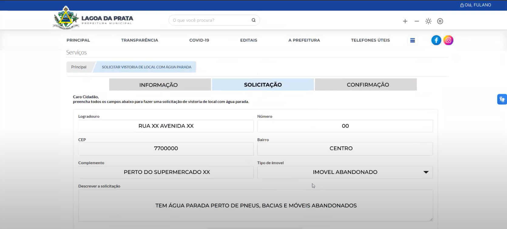

## Introdução

Os protótipos de alta fidelidade feitos desempenham um papel crucial no processo de design e desenvolvimento de sites, permitindo que designers e desenvolvedores testem e refinem suas ideias com um alto nível de detalhamento antes de se comprometerem com a implementação completa. Esses protótipos servem como uma visualização interativa quase real do produto final, permitindo que os usuários testem funcionalidades, navegação e forneçam feedback valioso.

Durante a fase de design e desenvolvimento de um site, os protótipos de alta fidelidade são essenciais para explorar e comunicar conceitos, layouts e fluxos de interação de maneira precisa e eficaz. Utilizando ferramentas avançadas do Figma, como componentes reutilizáveis, interações e animações, esses protótipos facilitam uma colaboração detalhada e iterativa entre as equipes de design e desenvolvimento.

Além disso, obter feedback dos usuários através de protótipos de alta fidelidade é fundamental para assegurar a usabilidade e a satisfação do público-alvo. Ao observar e entrevistar os usuários durante a interação com esses protótipos, é possível identificar problemas de usabilidade, áreas de confusão e oportunidades de melhoria com uma fidelidade próxima ao produto final. Essas informações são vitais para aprimorar o design do site, otimizar a experiência do usuário e minimizar retrabalhos nas fases posteriores do desenvolvimento.

## Objetivo 
O objetivo de realizar a avaliação somativa é julgar a qualidade de uso de uma solução de IHC buscando evidências que indiquem que as metas de design foram alcançadas. (Bruno Silva e Simone Barbosa)[1]
Com relação ao objetivo deste documento, que é realizar o relato dos resultados obtidos na avaliação do protótipo de alta fidelidade com relação a tarefa de "Registrar e verificar o panorama de saúde da cidade", realizado pelo integrante do grupo [Lucas Meireles](https://github.com/Katuner).

## Metodologia
Para realização da avaliação somativa do protótipo será utilizado o método de inspeção focado em heurísticas (Nielsen e Molich, 1990; Nielsen, 1992, 1994), diferentemente do definido pelo planejamento da avaliação, devido a problemas de saúde do integrante responsável. Com a mudança de método de avaliação, também é levantado o fato de que os problemas e avaliações encontrados não necessariamente serão problemas e situações reais, apenas previsões, pendendo uma nova verificação com usuários reais para então validar os itens elencados. Para conformidade com os perfis de usuário levantados pelo grupo, serão realizadas 3 inspeções, uma para cada perfil. 

## Tarefa
A tarefa que foi testada e que será relatada nesse documento é a tarefa de "Registrar e verificar o panorama de saúde da cidade" descrita melhor na [Análise Hierárquica de Tarefas 4](../../requisitos1/analise-tarefas.md#análise-da-tarefa-hta-4-registrar-e-verificar-o-panorama-de-saúde-da-cidade---lucas-meireles) e [Análise de Tarefas CNM-GOMS 2](../../requisitos1/analise-tarefas.md#análise-da-tarefa-cnm-goms-2-registrar-e-verificar-o-panorama-de-saúde-da-cidade---fonte-meireles-lucas-2024).

## Protótipo de Alta Fidelidade
O protótipo de alta fidelidade foi feito de acordo com todos os artefatos produzidos ao longo da disciplina na análise de requisitos, sendo eles: [Principios Gerais](../../requisitos2/principios_gerais.md), [Metas de Usabilidades](../../requisitos2/metas-usabilidade.md), [Guias de Estilo](../../requisitos2/guia-de-estilo.md) e [Caracteristicas da Plataforma](../../requisitos2/caracteristicas.md).

Abaixo se encontram as figuras com relação ao protótipo de alta fidelidade realizado para essa tarefa na ferramenta Figma[4] e o script utilizado no teste piloto e inspeções.

**Figura 01** - Script da tarefa Registrar e verificar o estado de saúde

*Fonte: [MEIRELES, Lucas O.](https://github.com/Katuner). 2024.*

A seguir se encontram as figuras separadas de cada tela do protótipo de alta fidelidade e suas descrições.

### Home Page
Abaixo na figura 02, se encontra a tela homepage do protótipo.

**Figura 02** - Homepage

*Fonte: [MEIRELES, Lucas O.](https://github.com/Katuner). 2024.*

### Menu Saúde
Abaixo na figura 03, se encontra o overlay que diz respeito ao menu que se abre ao acessar o botão "Saúde" na Home Page (figura 2).

**Figura 03** - Menu Saúde

*Fonte: [MEIRELES, Lucas O.](https://github.com/Katuner). 2024.*

### Página inicial - Estado de saúde
Abaixo na figura 04, se encontra a página incial que diz respeito à funcionalidade do registro de estado de saúde.

**Figura 04** - Página - Estado de Saúde

*Fonte: [MEIRELES, Lucas O.](https://github.com/Katuner). 2024.*

### Registro de estado
Abaixo na figura 05, se encontra o overlay que diz respeito à primeira seleção do registro de estado de saúde, podendo se dividir em 2 fluxos distintos, os quais serão representados por fluxo A (FA) e fluxo B (FB).

**Figura 05** - Overlay para seleção do estado de saúde

*Fonte: [MEIRELES, Lucas O.](https://github.com/Katuner). 2024.*

#### FA - Me sinto bem
Abaixo se encontram as figuras 6 e 7, que dizem respeito, respectivamente, à tela de confirmação do endereço do usuário e à correção do endereço em caso de erro no registro.

**Figura 06** - Confirmação de endereço 

*Fonte: [MEIRELES, Lucas O.](https://github.com/Katuner). 2024.*

**Figura 07** - Correção de endereço

*Fonte: [MEIRELES, Lucas O.](https://github.com/Katuner). 2024.*

#### FB - Não me sinto bem

Abaixo se encontram as figuras 8, 9, 10, 11 e 12, que dizem respeito, respectivamente, à tela de seleção dos sintomas, à tela de seleção para registro ou não de uma consulta médica, à tela em caso positivo de registro de consulta médica, à tela de registro de locais frequentados pelo usuário e, por fim, uma tela de confirmação do registro de estado que segue após a finalização de qualquer fluxo, isto é, após a confirmação das telas apresentadas nas imagens 6 ou 7 (a depender da seleção), e 11.

**Figura 08** - Confirmação de endereço 

*Fonte: [MEIRELES, Lucas O.](https://github.com/Katuner). 2024.*

**Figura 09** - Escolha de consulta

*Fonte: [MEIRELES, Lucas O.](https://github.com/Katuner). 2024.*

**Figura 10** - Detalhes da Consulta

*Fonte: [MEIRELES, Lucas O.](https://github.com/Katuner). 2024.*

**Figura 11** - Locais frequentes

*Fonte: [MEIRELES, Lucas O.](https://github.com/Katuner). 2024.*

**Figura 12** - Confirmação de registro

*Fonte: [MEIRELES, Lucas O.](https://github.com/Katuner). 2024.*

### Verificação dos pontos de risco

Abaixo nas figuras 13 e 14, se encontram os overlays de exemplo para a apresentação dos dados do mapa geral de risco que está presente na página inicial da funcionalidade, apresentado na figura 3.

**Figura 13** - Overlay de estado 1

*Fonte: [MEIRELES, Lucas O.](https://github.com/Katuner). 2024.*

**Figura 14** - Overlay de estado 2

*Fonte: [MEIRELES, Lucas O.](https://github.com/Katuner). 2024.*

## Teste Piloto
Após concluir o planejamento da avaliação e antes de realmente fazer os testes de usabilidade, inspeção e questionários, foi realizado o teste piloto do protótipo de alta fidelidade da tárefa descrita neste artefato. Tal teste foi realizado pelo integrante do grupo 05 [Lucas Meireles](https://github.com/Katuner) como entrevistador e como entrevistado/usuário-alvo. Logo abaixo se encontra a tabela 01 contendo os dados com relação a gravação do teste piloto.

**Tabela 1** - Cronograma da Execução do Teste Piloto 

| Ordem | Data       | Horário de início e fim | Local                       | Entrevistadores                                    | Entrevistado                                      | Tarefas                                           |
| ----- | ---------- | ----------------------- | --------------------------- | -------------------------------------------------- | ------------------------------------------------- | ------------------------------------------------- |
| 1°    | 08/07/2025 | 20:15 - 21:25           | Residência do entrevistador | [Lucas Meireles](https://github.com/Katuner) | [Lucas Meireles](https://github.com/Katuner) | Registro e verificação do estado de saúde da cidade |

 *Fonte: [MEIRELES, Lucas O.](https://github.com/Katuner). 2024.*

Logo abaixo se encontra o vídeo 01 que contém a gravação do teste piloto e que também pode ser acessado [clicando aqui][https://www.youtube.com/watch?v=_vaesJe13Vg]:

**Vídeo 01** - Teste Piloto Tarefa Registro e verificação do estado de saúde da cidade

<iframe width="1864" height="793" src="https://www.youtube.com/embed/_vaesJe13Vg" title="Teste piloto alta" frameborder="0" allow="accelerometer; autoplay; clipboard-write; encrypted-media; gyroscope; picture-in-picture; web-share" referrerpolicy="strict-origin-when-cross-origin" allowfullscreen></iframe>

*Fonte: [MEIRELES, Lucas O.](https://github.com/Katuner). 2024.*

*Fonte: Página: 266,Capítulo 11. Processos de Design de IHC. Livro: Barbosa, S. D. J.; Silva, B. S. da; Silveira, M. S.; Gasparini, I.; Darin, T.; Barbosa, G. D. J. (2021) Interação Humano-Computador e Experiência do usuário. Autopublicação.*

### Considerações Finais 
Os erros encontrados no teste piloto foram rapidamente corrigidos para que fosse possível a realização dos testes de inspeção.

## Teste de Usabilidades
A seguir será destrinchado melhor como foi feita a seleção dos participantes, o local de avaliação e datas que ocorreram o teste de usabilidade assim como as ferramentas utilizadas e uma breve descrição dos testes.

### Seleção dos Participantes, Local e Datas
O número de participantes foram 1, sendo composto exclusivamente pelo integrante responsável à tarefa aqui avaliada, [Lucas Meireles](https://github.com/Katuner). A escolha do perfil a ser incorporado na avaliação de inspeção heurística foi feita baseando-se nas características definidas no [perfil do usuário](../../requisitos1/perfil-do-usuario.md). Como dito anteriormente a escolha da quantidade de usuários para o teste condiz com a quantidade de perfis de usuários elencados pelo grupo.

Abaixo se encontra a tabela 04 que mostra o cronograma da execução das inspeções

**Tabela 05** - Cronograma executado de entrevistas

| Ordem | Data       | Horário de início e fim | Local                 | Entrevistador                                       | ID do perfil utilizado     | Tarefa                                            |
| ----- | ---------- | ----------------------- | --------------------- | --------------------------------------------------- | ---------------- | ------------------------------------------------- |
| 1°    | 08/07/2024 | 19:05 -            | Residência do integrante | [Lucas Meireles](https://github.com/Katuner) | 1 | Registro e verificação do estado de saúde da cidade |
| 2°    | 08/07/2024 | XXXX - XXXX           | Residência do integrante | [Lucas Meireles](https://github.com/Katuner) | 2      | Registro e verificação do estado de saúde da cidade |
| 3°    | 08/07/2024 | XXXX - XXXX           | Residência do integrante | [Lucas Meireles](https://github.com/Katuner) | 3         | Registro e verificação do estado de saúde da cidade |

 *Fonte: [MEIRELES, Lucas O.](https://github.com/Katuner). 2024.*

### Ferramentas utilizadas
As seguintes ferramentas foram utilizadas durante as gravações do teste de usabilidade:

- Um computador com acesso à internet e câmera externa;
- Um papel contendo o script a ser seguido pelos usuários;

### Descrição dos Testes
Antes de se iniciar as inspeções, o integrante refaz a leitura do script contendo as ações e opções que o perfil iria realizar no protótipo. O teste se inicia na Home Page geral e é finalizado após a conclusão de qualquer um dos Fluxos previamente elencados. Para quesitos de verificação, todas as telas e possibilidades serão exploradas.

### Planejamento do Reprojeto
Ao final de cada inspeção, após o elencamento de potenciais problemas encontrados, deve-se elucidar opções de correção para solucionar os potenciais problemas ou ainda evitar que eles possam vir a se concretizar.

## Teste 01

Abaixo se encontra a tabela 06 que mostra o cronograma da execução da primeira inspeção, contendo a data, horário, local, entrevistador, Id do perfil utilizado e a tarefa testada.

**Tabela 06** - Cronograma executado de inspeção

| Ordem | Data       | Horário de início e fim | Local                 | Entrevistador                                     | ID do perfil utilizado     | Tarefa                                            |
| ----- | ---------- | ----------------------- | --------------------- | --------------------------------------------------- | ---------------- | ------------------------------------------------- |
| 1°    | 08/07/2024 | 16:00 - 16:06           | Residência do integrante | [Lucas Meireles](https://github.com/Katuner) | 1 | Registro e verificação do estado de saúde da cidade |

 *Fonte: [MEIRELES, Lucas O.](https://github.com/Katuner). 2024.*

Logo abaixo se encontra o vídeo 02 que contém a gravação da inspeção 01 e que também pode ser acessado [clicando aqui](https://youtu.be/-0p9y3cgT_I).

**Vídeo 02** - Teste de Usabilidade 01 

<iframe width="560" height="315" src="https://www.youtube.com/embed/-0p9y3cgT_I?si=oIEtPI9WJcSpkxF3" title="YouTube video player" frameborder="0" allow="accelerometer; autoplay; clipboard-write; encrypted-media; gyroscope; picture-in-picture; web-share" referrerpolicy="strict-origin-when-cross-origin" allowfullscreen></iframe>

*Fonte: [MEIRELES, Lucas O.](https://github.com/Katuner). 2024.*

Abaixo na tabela 07 encontra as respostas do Perfil analisado, adquiridas através do questionário realizado após o teste de usabilidade.

**Tabela 07** - Questiónario aplicado pós teste de usabilidade do teste de usabilidade 01

| ID  | Pergunta                                                            | Resposta do entrevistado | Justificativa                                                                                            |
| --- | ------------------------------------------------------------------- | ------------------------ | -------------------------------------------------------------------------------------------------------- |
| 1   | A interface apresentada foi de fácil utilização?                    | SIM                      | -                                                                                                        |
| 2   | Existe uma correspondência com a realidade ao realizar essas ações? | SIM                      | Sim e acredito que um usuário comum poderia facilmente realizar a tárefa utilizando o fluxo que utilizei |
| 3   | Teve algum problema com a disposição dos elementos na tela?         | NAO                      | Não, não tive nenhum problema e acredito que esteja bem responsivoa                                      |
| 4   | Teve alguma dificuldade ao realizar as tarefas designadas?          | NÃO                      | -                                                                                                        |
| 5   | Teve de lidar com algum erro durante a utilização do sistema?       | NÃO                      | -                                                                                                        |

*Fonte: Página: 266,Capítulo 11. Processos de Design de IHC. Livro: Barbosa, S. D. J.; Silva, B. S. da; Silveira, M. S.; Gasparini, I.; Darin, T.; Barbosa, G. D. J. (2021) Interação Humano-Computador e Experiência do usuário. Autopublicação.*

Pela tabela 08 a seguir é possível identificar o preenchimento do questionário destinado ao avaliador ao revisar as informações do teste 01.

**Tabela 09** - Perguntas para o avaliador sobre teste de usabilidade 01

| ID  | Pergunta                                                                                     | Tipo de Resposta                                                                                                                | Observação |
| --- | -------------------------------------------------------------------------------------------- | ------------------------------------------------------------------------------------------------------------------------------- | ---------- |
| 6   | O usuário conseguiu operar o sistema?                                                        | SIM                                                                                                                             | -          |
| 7   | Ele atinge seu objetivo? Com quanta eficiência? Em quanto tempo? Após cometer quantos erros? | SIM   100% DE EFICIÊNCIA    em 0:52 minutos   0 ERROS COMETIDOS                                                        | -          |
| 8   | Ele entendeu o que deveria ser feito em seguida?                                             | SIM                                                                                                                             | -          |
| 9   | Quais barreiras o usuário encontrou ao atingir seus objetivos?                               | Apenas um problema de implementação do Figma em que ele não estava conseguindo descer a página depois de preecnher o formulário | -          |
| 10  | Quantas vezes os usuários consultaram a ajuda para realizar uma ação?                        | NENHUMA                                                                                                                         | -          |

*Fonte: Página: 266,Capítulo 11. Processos de Design de IHC. Livro: Barbosa, S. D. J.; Silva, B. S. da; Silveira, M. S.; Gasparini, I.; Darin, T.; Barbosa, G. D. J. (2021) Interação Humano-Computador e Experiência do usuário. Autopublicação.*

### Problemas Encontrados

#### ID 9 - Quais barreiras o usuário encontrou ao atingir seus objetivos?  
- Foi encontrado um problema em que ao clicar pra preencher o formulário e tentar descer ou subir a pagina com o ponteiro do mouse em cima do formulário preenchido, a ação não funcionava. Isso se dava por uma limitação da escolha de implementação realizada no Figma[4] e que posteriormente foi corrigido no teste de usabilidade 03. Conforme mostra a figura 10 a seguir ou entre os minutos 2:51 e 2:58 do vídeo 02 mostrado anteriormente.

**Figura 10** - Problema relacionado ao ID 9

*Fonte: [MEIRELES, Lucas O.](https://github.com/Katuner). 2024.*

A tabela 10 abaixo resume a avaliação do problema encontrado

**Tabela 10** - Perguntas para o avaliador

| Item de Análise                      | Descrição                                                                                        |
| ------------------------------------ | ------------------------------------------------------------------------------------------------ |
| Local:                               | Página Solicitação Preenchida                                                                    |
| Descrição:                           | O usuário após clicar para preencher o formulário tenta descer ou subir a página e não consegue. |
| Justificativa:                       | Implementação realizada no Figma de forma errada                                                 |
| Ação Realizada pelo Usuário:         | Moveu o scroll do mouse para baixo                                                               |
| Resposta do Sistema Esperada:        | Descer a página                                                                                  |
| Resposta apresentada pelo Sistema:   | Nada acontece                                                                                    |
| Fatores de Usabilidade Prejudicados: | Eficiência                                                                                       |

*Fonte: Página: 319,Capítulo 12. Avaliação de IHC através de Observação. Livro: Barbosa, S. D. J.; Silva, B. S. da; Silveira, M. S.; Gasparini, I.; Darin, T.; Barbosa, G. D. J. (2021) Interação Humano-Computador e Experiência do usuário. Autopublicação.*

### Planejamento para reprojeto
Para a reprojeto, as correções deviam ser realizadas de acordo com os problemas encontrados anteriormente e antes da próxima gravação do teste de usabilidade 02, entretanto, o mesmo não foi feito sendo realizado apenas após a gravação do teste de usabilidade 02.

## Consolidação de dados coletados
Após uma análise dos dados coletados de todos os testes de usabilidades apresentados foi possível fazer uma tabela comparativa para uma, a tabela 23 a seguir mostra o tempo necessário para realizar a tarefa, a quantidade de erros cometeidos e a quantidade de consulta que o usuário teve para realizar a ação de acordo com cada teste de usabilidade realizado. 

**Tabela 23** - Dados coletados dos testes

| Teste de Usabilidade | Tempo necessário para realizar tarefa em minutos | Erros cometidos | Quantidade de consulta de ajuda para realizar ação |
| -------------------- | ------------------------------------------------ | --------------- | -------------------------------------------------- |
| 01                   | 0:52                                             | 0               | 0                                                  |
| 02                   | 2:32                                             | 0               | 0                                                  |
| 03                   | 2:08                                             | 4               | 6                                                  |
| 04                   | 1:18                                             | 0               | 1                                                  |
| 05                   | 0:26                                             | 0               | 0                                                  |
| Média                | 1:27                                             | 0,8             | 1,4                                                |

*Fonte: [MEIRELES, Lucas O.](https://github.com/Katuner). 2024.*

## Bibliografia

> [1] Barbosa, S. D. J.; Silva, B. S. da; Silveira, M. S.; Gasparini, I.; Darin, T.; Barbosa, G. D. J. (2021) Interação Humano-Computador e Experiência do usuário. Autopublicação.

> [2] Dumas, J. S., & Redish, J. C. (1999). A practical guide to usability testing. Intellect Books.

> [3] NIELSEN, Jakob. Usability Engineering. Academic Press, 1993.

> [4] FIGMA. Disponivel em: https://www.figma.com Acesso em: 03 de julho de 2024.

> [5] Ericsson, K. Anders e Simon, Herbert A. (1993). Protocol Analysis - Rev’d Edition: Verbal Reports as Data. Bradford Books, Cambridge, Mass, revised edition edition.

> [6] Nielsen, Jakob e Molich, Rolf (1990). Heuristic evaluation of user interfaces. In Proceedings of the SIGCHI Conference on Human Factors in Computing Systems, CHI ’90, pages 249–256, New York, NY, USA. Association for Computing Machinery

> [7] Nielsen, Jakob (1992). Finding usability problems through heuristic evaluation. In Proceedings of the SIGCHI Conference on Human Factors in Computing Systems, CHI ’92, pages 373–380, New York,NY, USA. Association for Computing Machinery.

> [8] Nielsen, Jakob (1994). Heuristic evaluation. In Usability inspection methods, pages 25–62. John Wiley & Sons, Inc., USA.

## Histórico de Versões
|    Data    | Versão |               Descrição                |                  Autor(es)                  | Data de revisão | Revisor(es) |
| :--------: | :----: | :------------------------------------: | :-----------------------------------------: | :-------------: | :---------: |
| 07/07/2024 | `1.0`  |  Criação do documento e Teste piloto   | [Pedro Lucas](https://github.com/lucasdray) |                 |             |
