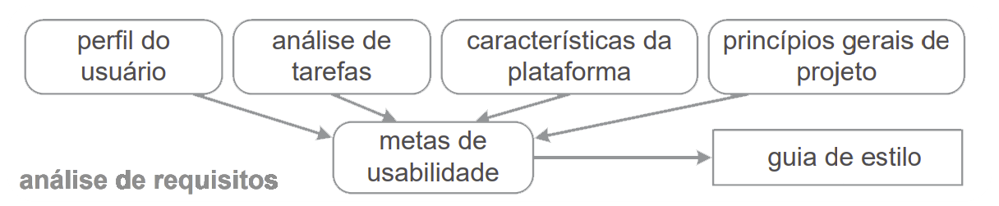

## Introdução

Pegando como base o Ciclo de Vida de Mayhew, a fase inicial do processo de design é a análise de requisitos. Durante essa etapa, é essencial examinar as capacidades e limitações da plataforma para entender como a aplicação se comporta e identificar possíveis melhorias. As avaliações abrangem equipamentos, sistemas operacionais, recursos de rede, entre outros elementos.

Esta é uma análise que aborda tecnologia, portabilidade e outros aspectos importantes da plataforma. Considere o que seus usuários desejam e quais são os principais recursos do seu produto. Representado na figura abaixo parte desse ciclo. 

**Figura 1** - Recorte com começo do ciclo de vida de Mayhew.

*Fonte: Barbosa, S. D. J.; Silva, B. S. da; Silveira, M. S.; Gasparini, I.; Darin, T.; Barbosa, G. D. J. (2021); Interação Humano-Computador e Experiência do usuário*

## Objetivo

O objetivo deste documento é descrever as características do site da Prefeitura da Lagoa da Prata a fim de realizar um levantamento de requisitos a fim de desenvolver propostas de intervenções para melhoria da plataforma. 

## Metodologia

Utilizamos a metodologia de Observação para a realização deste artefato, uma vez que, seria a melhor metodologia em que o grupo poderia aplicar devido a recursos e tempo. Abordagem essa que é detalhada no capítulo 10 do livro "Interação Humano Computador", da autora Simone Barbosa [3]. 

## Adaptabilidade, Performance e Acessibilidade

A Adaptabilidade, conforme definido pela ISO/IEC 25010, é um dos subindicadores da qualidade Flexibidade, definido como: [2] "Grau de eficácia e eficiência com que um sistema, produto ou componente pode ser transferido de um hardware, software ou outro ambiente operacional ou de uso para outro". 

Observando o site da [Prefeitura de Lagoa da Prata](https://www.lagoadaprata.mg.gov.br/) percebemos seguintes pontos que agregam sobre adaptabilidade:

- Compatibilidade com os principais navegadores do mercado (Google Chrome, Mozilla Firefox, Microsoft Edge, Safarim entre outros), fundamental para um site governamental.
- Design responsivo, garantindo compatibilidade com diferentes tamanhos de tela seja entre computadores (1280 x 1024 até 3840 x 2160) ou em dispositivos móveis (como 4.0 até 6.9)
- Versão mobile otimizada, adaptando-se ao tamanho da tela do dispositivo seja de celulares menores a tablets com telas maiores.

O Comportamento temporal, conforme definido pela ISO/IEC 25010, é um dos subindicadores da qualidade Performance de Eficiência, e é definido como: [2] "Grau em que o tempo de resposta e as taxas de rendimento de um produto ou sistema, ao executar suas funções, atendem aos requisitos". A partir da observação do site da Prefeitura de Lagoa da Prata, percebemos que o tempo de resposta é satisfatório, com carregamento rápido das páginas e conteúdos, mesmo em conexões mais lentas.

A Assistência ao usuário, conforme definido pela ISO/IEC 25010, é um dos subindicadores da qualidade Capacidade de Interação, e é definido como: [2] "Grau em que um produto pode ser usado por pessoas com a mais ampla gama de características e capacidades para atingir objetivos específicos em um contexto de uso específico". Observando o site da Prefeitura de Lagoa da Prata, percebemos que possúi acessibilidade aprimorada, incluindo contraste de cor, opções de aumento do tamanho da fonte, tradução para libras e fonte especial para dislexia.

## Tecnologias Utilizadas e Hardware necessário

Pela falta de documentação do site para encontrar as tecnologias que foram utilizadas, utilizamos ferramentas como a extensão do google "Wappalyzer" e o view-source do navegador, encontrando os listados a seguir:

**Figura 2** - Tecnologias via Wappalyzer.

*Fonte: [DOURADO, Pedro Lucas](https://github.com/lucasdray). 2024.*

Com isso percebe-se que para acessar o site da Prefeitura Munincipal de Lagoa da Prata os requisitos de hardware são basicos.

Caso o acesso seja optado por Computador pessoal (PC ou Laptop):

- Dispositivo apontador (Mouse, touchpad, etc.).
- Teclado físico ou virtual.
- Conectividade com internet estável (Cabo Ethernet, Wi-Fi).

Caso o acesso seja optado por um Dispositivo móvel (Smarthphone ou Tablet):

- Tela sensivel ao toque
- Teclado virtual
- Conectividade com internet estável (Wi-Fi ou dados móveis).

## Características Negativas da Plataforma

- Excesso de funcionalidades e abas, resultando em uma curva de aprendizado mais íngreme para o usuário.
- Redirecionamento para abas externas em algumas funcionalidades complexas e que não possui botão de retorno para a página princial, o que pode acabar causando desorientação no usuário prejudicando sua experiência. Como por exemplo ao tentar acessar o portal de transparência, fazer cadastramento escolar ou entrar em contato com a prefeitura, que redirecionam para links externos, com cores e design totalmente diferentes dos encotrados no site da Prefeitura. 
- Embora o site esteja funcionando bem na versão mobile, caso o usuário opte por acessar dessa forma vai ter sua experiência prejudicada, uma vez que existe muito redirecionamento para abas externas as quais não estão otimizadas para o uso na versão mobile.

## Intervenção 

Ao analisar as características do site da Prefeitura Municipal de Lagoa da Prata, fica evidente a importância de um artefato de intervenção bem planejado para melhorar a experiência do usuário. Embora o site apresente várias qualidades positivas, como compatibilidade com diferentes navegadores, design responsivo e alta acessibilidade, também enfrenta desafios que afetam a usabilidade e a navegabilidade. A presença de excesso de funcionalidades e redirecionamentos para abas externas sem retorno claro à página principal.

Abaixo se encontram algumas ideias de intervenção para melhorar a experiência do usuário: 

- Reestruturação da Navegação, como por exemplo, simplificar o menu principal e reduzir o número de subcategorias e abas para facilitar a localização de inforamações. Mas, um ponto negativo dessa reestruturação seria que pode inicialmente confundir usuários acostumados com a estrutura anterior, exigindo um período de adaptação.
- Redução de Redirecionamento Externos, como por exemplo, minimizar o uso do redirecionamento para páginas externas, principalmente para as funcionalidades como o portal de transparência e formulários de contato com a prefeitura. Um dos pontos negativos dessa intervenção seria que, caso, esses redirecionamentos externos estejam fora de controle direto da prefeitura, seria necessário cooperação adicional de terceiros. 
  
Embora as intervenções visem melhorar a experiência do usuário, é essencial considerar cuidadosamente esses pontos negativos potenciais durante o planejamento.

## Bibliografia
> [1] Site da Prefeitura da Lagoa da Prata. Disponivel em: hhttps://www.lagoadaprata.mg.gov.br/ .

> [2] ISO 25010. Disponível em: https://iso25000.com/index.php/en/iso-25000-standards/iso-25010?start=6. Acesso em: 07 jul. 2024.
 
> [3] Barbosa, S. D. J.; Silva, B. S. da; Silveira, M. S.; Gasparini, I.; Darin, T.; Barbosa, G. D. J. (2021); Interação Humano-Computador e Experiência do usuário.

## Historico de Versões

|    Data    | Versão |       Descrição       |                  Autor(es)                   | Data de revisão |                 Revisor(es)                 |
| :--------: | :----: | :-------------------: | :------------------------------------------: | :-------------: | :-----------------------------------------: |
| 13/05/2024 | `1.0`  | Criação do documento  | [Cainã Freitas](https://github.com/freitasc) |   13/05/2024    | [Pedro Lucas](https://github.com/lucasdray) |
| 03/06/2024 | `2.0`  | Correções pós entrega artefato 3 | [Pedro Lucas](https://github.com/lucasdray)  |       07/07/2024         |               [Cainã Freitas](https://github.com/freitasc)   |
| 04/07/2024 | `3.0`  | Correção e refatoração pós verificação | [Augusto Duarte](https://github.com/Augcamp)  |        07/07/2024         |               [Cainã Freitas](https://github.com/freitasc)                              |
| 07/07/2024 | `3.0`  | Reestruturação, reescreve referencias e adiciona portabilidade | [Cainã Freitas](https://github.com/freitasc)  |        07/07/2024         |               [Cainã Freitas](https://github.com/freitasc)                              |