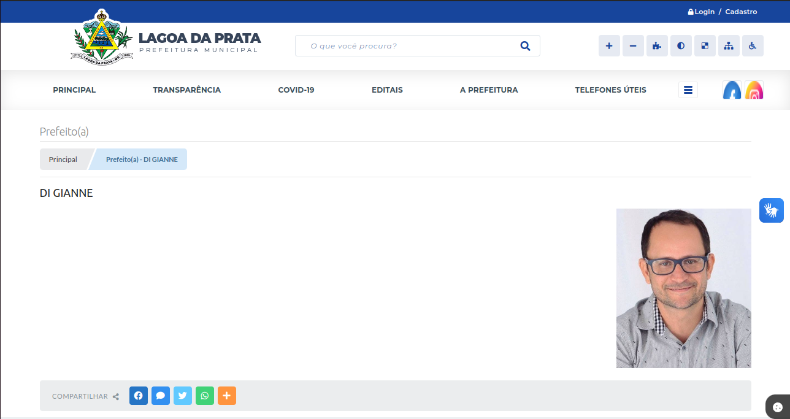
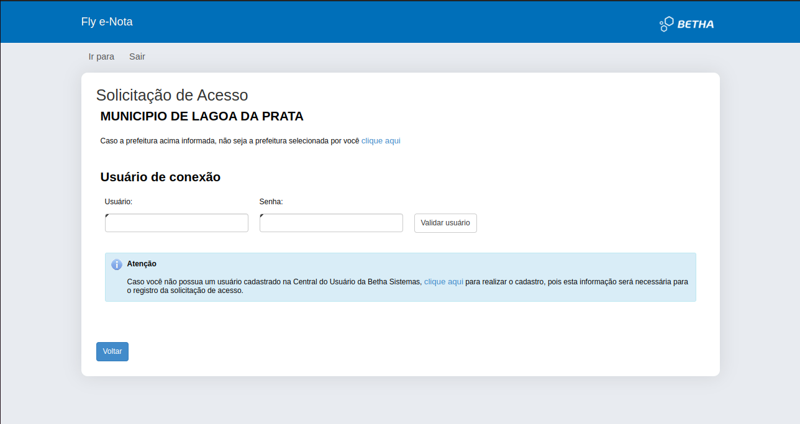
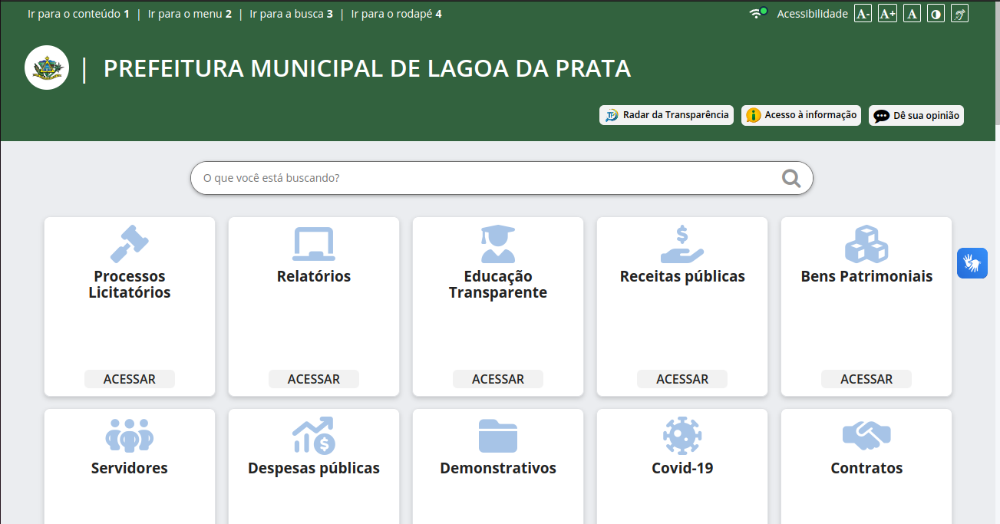
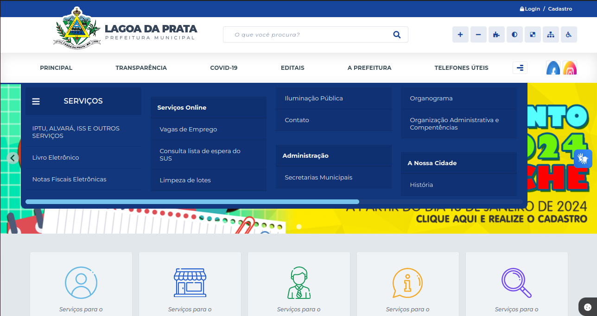

## Introdução
Este documento tem como objetivo definir as metas de usabilidade para o projeto presente que realizará uma avaliação do site da Prefeitura de Lagoa da Prata, estabelecendo quais fatores de qualidade devem ser priorizados no projeto, bem como a forma com a qual a avaliação ocorrerá durante o processo de design. 
A equipe irá se basear nas metas de usabilidade definidas por Nielsen (1999) [2] para realizar as devidas verificações e consequentemente a avaliação como um todo para o site,
visando como objetivo primário a melhor intuição e tranquilidade do usuário durante sua navegação pelo site.

## Definição das Metas de Usabilidade

Através da análise de Barbosa (2021) [1] sobre o trabalho de Nielsen (1999) [2], é possível identificar 6 metas de usabilidade principais, sendo elas tratadas a seguir:

- Facilidade de Aprendizado (learnability): Refere-se à facilidade com que os usuários conseguem aprender a utilizar o site e se tornar competentes na realização das tarefas.

- Facilidade de recordação (memorability): Refere-se à qualidade do produto de cumprir com aquilo que foi planejado para fazer, ou seja, se ele é capaz de cumprir suas funcionalidades da forma que foram planejadas para serem realizadas.

- Eficiência (efficiency): Refere-se à forma e facilidade com a qual os usuários são capazes de realizar suas tarefas no site, preferencialmente no menor número possível de passos.

- Segurança no uso (safety): Refere-se à proteção do usuário contra situações indesejadas, como a perda de dados, a realização de ações inadvertidas e em como o sistema é capaz de fornecer um ponto de retorno ao usuário para se recuperar de eventuais falhas.

- Satisfação do usuário (satisfaction): Refere-se à avaliação subjetiva do impacto emocional e dos sentimentos que o uso do site pode causar nos usuários. É uma medida qualitativa que vai além da eficiência ou funcionalidade técnica.

Também, durante a análise sobre a norma ISO 9241-11 (2019), que define usabilidade como "O grau em que um produto é usado por usuários específicos para atingir objetivos específicos
com eficácia, eficiência e satisfação em um contexto de uso específico", Barbosa (2021) [1] identificou mais uma meta de usabilidade:

- Eficácia: Refere-se à capacidade do sistema de realizar as funções para as quais foi projetado, ou seja, está relacionada com a capacidade de os usuários interagirem com o sistema
para alcançar seus objetivos corretamente, conforme o esperado

## Metas a serem conquistadas pelo nosso projeto
Para definir as metas que desejamos alcançar foram levantadas as seguintes questões sobre cada meta:

- Eficácia: O sistema atende às funções à qual foi projetado?
    - O site fornece diversas formas de informações públicas, como lista de espera de creches, lista de espera para o SUS, consulta de editais, itens relacionados à prestação de serviços, itens relacionados à transparência de gastos, entre outros. Há porém de se analisar as diversas partes do sistema, que se apresenta para diversas funcionalidades à diferentes áreas, como cidadão, empresa, funcionários, etc. O site avaliado apresenta algumas páginas e funcionalidades que estão incompletas ou não aparentam ter sido implementadas até então, como é o caso de uma listagem de prefeitos, de informações do prefeito atual, de eventos atuais, entre outros. Sendo demonstrado na Figura 1 a seguir:

**Figura 1** - Login em Guia Externa

Disponível em https://www.lagoadaprata.mg.gov.br/portal/. Acesso em 03/06/2024

- Eficiência: Quanto tempo leva para realizar uma tarefa específica?
    - A maioria das atividades no site é realizada em poucas interações, como consultas de editais e acesso à listas de espera, mas algumas atividades levam a links externos que exigem login ou preenchimento de formulários, comumente visto em áreas para empresas ou verificações de impostos pelo cidadão. Sendo demonstrado na Figura 2 a seguir:

**Figura 2** - Login em Guia Externa

Disponível em https://www.lagoadaprata.mg.gov.br/portal/. Acesso em 03/06/2024

- Segurança no uso: O sistema evita erros ou ações indesejáveis? Ele permite recuperar ações anteriores?
    - O site não oferece alternativas de segurança para evitar erros, especialmente para atividades que levam a guias externas. Como mostra a Figura 3 a seguir:

**Figura 3** - Guia Externa sem retorno

Disponível em https://www.lagoadaprata.mg.gov.br/portal/. Acesso em 03/06/2024

- Facilidade de Aprendizado:  É fácil aprender a usar o sistema, mesmo para usuários inexperientes com a plataforma e com a tecnologia?
    - O site oferece uma experiência de aprendizado intuitiva e os dados estão organizados de forma que facilitem a utilização de determinadas funções, porém existem funções e informações que estão "escondidas" pelo site e exigem mais atenção à detalhes e movimentação do usuário por outras páginas para encontrá-las.

- Facilidade de recordação: Que suporte é oferecido para auxiliar o usuário a realizar tarefas, especialmente as não recorrentes?
    -  Não é oferecido nenhum guia ou suporte ao usuário, logo o usuário depende inicialmente de que nenhuma mudança seja feita na página inicial do sistema levando a uma memorização das funcionalidades requiridas e também corre o risco de perder um acesso rápido à alguma funcionalidade caso o site remova do destaque aquilo que o usuário estava buscando, como é o caso de notícias mostrado na Figura 5 abaixo.

**Figura 4** - Funcionalidade de díficil localização

Disponível em https://www.lagoadaprata.mg.gov.br/portal/. Acesso em 03/06/2024

- Satisfação do usuário: O site prioriza os criterios de usabilidade com base na necessidade do usuario, fazendo pesquisas e feedbacks para melhorar a experiência do usuário?
    -  Não, o site está mais centrado em fornecer informações institucionais, como serviços oferecidos, notícias da cidade e comunicados oficiais, do que em personalizar a experiência do usuário.

**Figura 5** - Serviços oferecidos, notícias e, informações

Disponível em https://www.lagoadaprata.mg.gov.br/portal/. Acesso em 04/07/2024

## Conclusão

A complexidade de oferecer um sistema que seja igualmente eficiente, fácil de aprender e satisfatório 
para diversos tipos de usuários é um desafio, por  exemplo, um sistema destinado a usuários experientes pode 
privilegiar a eficiência e a velocidade de execução das tarefas, enquanto um sistema voltado para iniciantes 
pode enfatizar a facilidade de aprendizado e a ajuda contextual.

Então, é importante conhecermos as necessidades dos usuários e estabelecermos quais critérios de usabilidade
devem ser priorizados no sistema em questão. Com base na análise feita no documento [Perfil do Usuário](../requisitos1/perfil-do-usuario.md), foi possível identificar tres perfis de usuários que serão utilizados para a avaliação do site da Prefeitura de Lagoa da Prata, sendo eles:
 
1) Usuário abaixo de 21 anos, do sexo masculino, com ensino médio completo e alta afinidade com tecnologia que busca registrar problemas na infraestrutura da cidade, obter informações de eventos e notícias da cidade.

2) Usuário de 21 a 30 anos, do sexo masculino, com ensino superior incompleto e alta afinidade com tecnologia que busca verificar informações de saúde da cidade, verificar vagas de emprego e eventos da cidade.

3) Usuário de 31 a 40 anos, do sexo feminino, com ensino superior incompleto e baixa afinidade com tecnologia que busca receber informações sobre a saúde da cidade, registrar filhos em escolas e creches.

Com isso foi feita a seguinte tabela com resultados, correlacionando as metas de usabilidade com os perfis de usuários:

| Meta de usabilidade | Como será feito a avaliação                                                                                                                                                                           | Perfil de usuário                                                                                                                                                                                     |
|:---------------------|:-------------------------------------------------------------------------------------------------------------------------------------------------------------------------------------------------------|:-------------------------------------------------------------------------------------------------------------------------------------------------------------------------------------------------------|
| Eficiência          | Verificar quanto tempo leva para realizar uma tarefa específica.                                                                                                                                      | 1, 2 e 3 |
| Segurança no uso    | Verificar se o sistema evita erros ou ações indesejáveis e se permite recuperar ações anteriores.                                                                                                    | 1, 2 e 3 |
| Facilidade de Aprendizado | Verificar se é fácil aprender a usar o sistema, mesmo para usuários inexperientes.                                                                                                                    | 3 |
| Facilidade de Recordação | Verificar que suporte é oferecido para auxiliar o usuário a realizar tarefas, especialmente as não recorrentes.                                                                                     | 1 e 2 |

## Referências Bibliográficas

> [1] Barbosa, S. D. J.; Silva, B. S. da; Silveira, M. S.; Gasparini, I.; Darin, T.; Barbosa, G. D. J. (2021) Interação Humano-Computador e Experiência do usuário. Autopublicação.

> [2] NIELSEN, Jacob. Designing Web Usability: The Practice of Simplicity Peachpit Press, la edição 1999

## Historico de Versões

|    Data    | Versão |             Descrição              |                   Autor(es)                   | Data de revisão |                  Revisor(es)                  |
| :--------: | :----: | :--------------------------------: | :-------------------------------------------: | :-------------: | :-------------------------------------------: |
| 11/05/2024 | `1.0`  |        Criação do documento        | [Joyce Dionizio](https://github.com/joycejdm) |   11/05/2024    | [Lucas Meireles](https://github.com/Katuner)  |
| 11/05/2024 | `1.1`  |  Adição da estrutura do documento  | [Joyce Dionizio](https://github.com/joycejdm) |   11/05/2024    | [Lucas Meireles](https://github.com/Katuner)  |
| 11/05/2024 | `1.2`  | Definição das Metas de Usabilidade | [Joyce Dionizio](https://github.com/joycejdm) |   11/05/2024    | [Lucas Meireles](https://github.com/Katuner)  |
| 11/05/2024 | `1.3`  |   Ajuste de referencial e nomes    | [Lucas Meireles](https://github.com/Katuner)  |   13/05/2024    | [Augusto Duarte ](https://github.com/Augcamp) |
| 11/05/2024 | `1.4`  |    Ajuste de escrita e de metas    | [Lucas Meireles](https://github.com/Katuner)  |   13/05/2024    | [Augusto Duarte ](https://github.com/Augcamp) |
| 03/06/2024 | `2.0`  |  Correção pós entrega artefato 3   | [Pedro Lucas](https://github.com/lucasdray)   |    04/07/2024   | [Augusto Duarte ](https://github.com/Augcamp) |
| 04/07/2024 | `3.0`  |  Correção e refatoração pós verificação | [Augusto Duarte](https://github.com/Augcamp) |       07/07/2024          |                                              [Cainã Freitas](https://github.com/freitasc) |
| 07/07/2024 | `3.1`  |  Corrige referências das metas, cria tabela relacionando perfis de usuario escolhidos com metas pretendidas | [Cainã Freitas](https://github.com/freitasc) |             |       |
