## Introdução

Durante a realização de uma tarefa de design, é comum que se siga diversos guias, processos e premissas para que o trabalho, além de ter um embasamento teórico amplo e robusto, possua uma certificação maior de qualidade e consiga atingir seus objetivos predeterminados. De acordo com Barbosa (2021) [1], os responsáveis pelo design seguem 3 principais conjuntos de características em IHC, sendo eles princípios (objetivos gerais e alto nível), diretrizes (regras gerais de prática) e padrões (soluções específicas). 
É importante ressaltar, porém, que a utilização e embasamento de princípios e diretrizes não substitui as demais atividades gerais previstas, isto é, para este projeto, a importância de que quesitos estabelecidos pelo processo de design de Mayhew (1999) continue sendo seguido.

## Principais princípios e diretrizes de projeto

A comunidade de pesquisadores de IHC costumam seguir determinados princípios e diretrizes para exercer sua função, itens estes que serão trabalhados a seguir em comparação com 
o site da Prefeitura Municpal de Lagoa da Prata. Há um enfoque, também, na publicação de Norman (1988) que destaca algumas das diretrizes bases que hoje são consideradas como imprescindíveis para a realização da tarefa de design, como facilitação de aprendizado e compreensão do usuário, desenvolvimento de modelos conceituais, compreensão do estado do sistema, entre outros. 

## Metodologia 
Neste artefato iremos utilizar os prinípios e diretrizes de projeto de acordo com Norman (1988)[3], Tognazzini (2014)[4], as heurísticas de Nielsen (1994)[5] e as regras de ouro de Shneiderman (Shneiderman, 1998) [6]. Será apresentado cada um dos 8 princípios, tendo uma descrição e um tópico mostrando a violação do princípio cometida pelo site com prints demonstrando a mesma.
Para avaliação de violação será utilizado o método de inspeção utilizando a avaliação heurística das princípais funcionalidades do site. 

### Correspondência com as Expectativas dos Usuários
Devemos nos certificar de que o usuário consegue determinar os relacionamentos entre: intenções e ações possíveis; entre ações e seus efeitos no sistema; entre o estado real do sistema e o que é percebido pela visão, audição ou tato; entre o estado percebido do sistema e as necessidades, intenções e expectativas do usuário. [1]

#### Violação
Na Figura 1 abaixo, é possivel visualizar a violação da Correspondência com a Expectativa do Usuário, uma vez que o usuário clica para saber a respeito do prefeito da cidade e encontra apenas a foto e seu nome que não está completo

**Figura 01** - Violação sessão prefeito

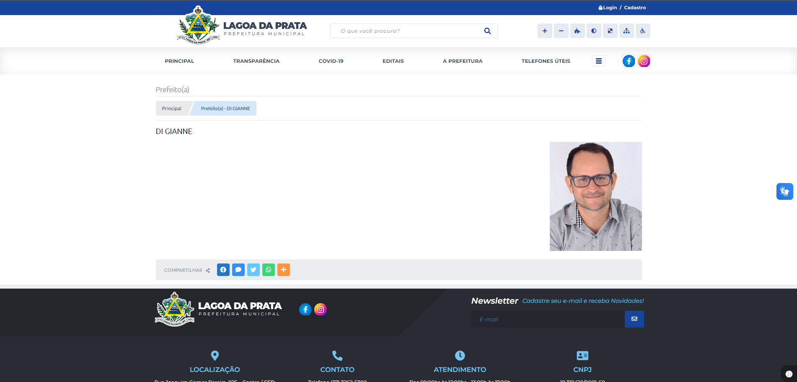

*Fonte: Prefeitura Municipal de Lagoa da Prata. 2024. Disponível em <https://www.lagoadaprata.mg.gov.br/portal/>. Acesso em 07/07/2024*

#### Correção
Atualizar as páginas que estão incompletas e violando a correspondência com as expectativas dos usuários como a mostrada na figura 01 acima, assim implementando as informações que estão faltando e que são importantes para o usuário que tem expectativas da funcionalidade estar funcionando.

### Simplicidade nas Estruturas das Tarefas
#### Definição
Para uma simplificação nas estruturas das tarefas deve-se reduzir a quantidade de planejamento e resolução [3], e para isso os designers podem seguir as 4 abordagens tecnológicas a seguir:
- manter a tarefa inalterada, mas oferecer diferentes formas de suporte para que os usuários possam aprender e executar a tarefa
- utilizar a tecnologia para tornar visível o que seria invisível, aprimorando o feedback e a capacidade do usuário de manter o controle da tarefa
- automatizar a tarefa, ou parte dela, mantendo-a inalterada
- alterar a natureza da tarefa

#### Violação
Na figura 2 abaixo, é possível visualizar uma violação da Simplicidade nas Estruturas das Tarefas em que o serviço de ouvidoria não é encontrado de nenhuma forma dentro do site da prefeitura e caso o usuário queria acessar o serviço teria que fazer uma busca usando um buscado externo como o Google para encontrar, como mostra a figura 3.

**Figura 02** - Busca ouvidoria 

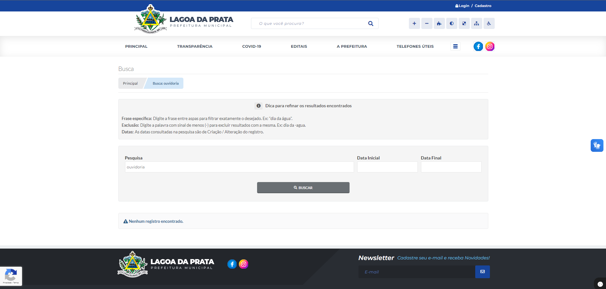

*Fonte: Prefeitura Municipal de Lagoa da Prata. 2024. Disponível em <https://www.lagoadaprata.mg.gov.br/portal/>. Acesso em 07/07/2024*

**Figura 03** - Busca ouvidoria externa

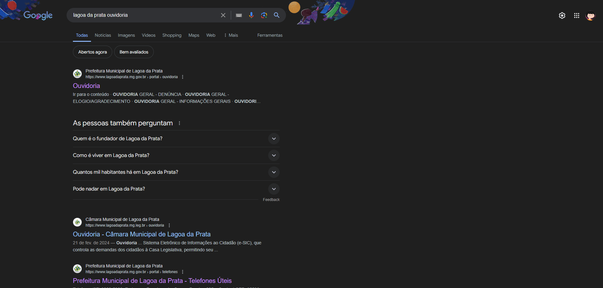

*Fonte: Prefeitura Municipal de Lagoa da Prata. 2024. Disponível em <https://www.lagoadaprata.mg.gov.br/portal/>. Acesso em 07/07/2024*

Abaixo temos a figura 4 que mostra que o serviço existe dentro da página mas não existem formas dentro do site para acessá-la

**Figura 04** - Ouvidoria

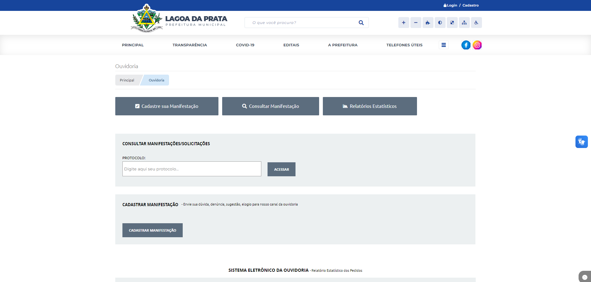

*Fonte: Prefeitura Municipal de Lagoa da Prata. 2024. Disponível em <https://www.lagoadaprata.mg.gov.br/portal/>. Acesso em 07/07/2024*

#### Correção
Implementar no site na aba de serviços e na busca o redirecionamento para a página da ouvidoria para que o usuário não precise realizar uma pesquisa externa para encontrar a funcionalidade

### Equilíbrio entre Controle e Liberdade do Usuário
#### Definição
De acordo com Tognazzini (2014), o computador, a interface e o ambiente de trabalho “pertencem” ao usuário. Isto é dizer que o usuário deve ter o maior controle e decisões de como alcançar seu objetivo sem se sentir "forçado" a uma sequência de ações fixa ou não possuir poder de decisão sobre as ações que está realizando. Isso implica que muitas vezes é vantajoso que o usuário seja capaz de realizar uma mesma tarefa de modos diferentes, ou até cancelar uma ação sem que o sistema o impeça ou penalize-o por isso. 

#### Violação
Na figura 05, podemos visualizar uma violação contra a liberdade do usuário, embora o site permita que ele visualize todos os tipos de registros encontrados, não é permitido para o usuário visualizar todos os registros de uma vez tendo que filtrar um por um e não podendo selecionar todos de uma vez

**Figura 05** - Busca falta de liberdade

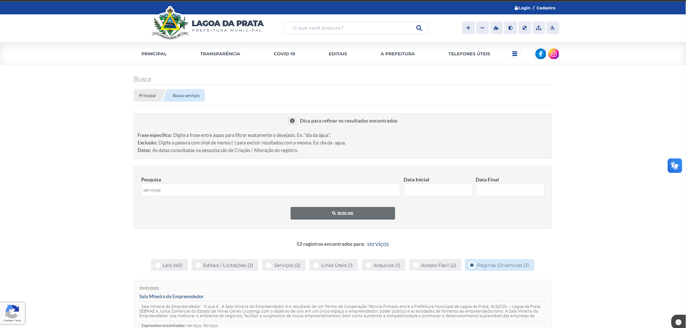

*Fonte: Prefeitura Municipal de Lagoa da Prata. 2024. Disponível em <https://www.lagoadaprata.mg.gov.br/portal/>. Acesso em 07/07/2024*

#### Correção
Permitir que o usuário possa ver todos os registros na busca sem selecionar um tipo de filtro.

### Consistência e Padronização
#### Definição
Para facilitar o aprendizado e uso de um sistema, recomenda-se assegurar a consistência da interface com o modelo conceitual embutido no sistema[3], sendo a mais importante consistência a de expectativas dos usuários e quando essa correspondência não for possível é preciso padronizar [3][4].

#### Violação
Mesmo que o site em sua maior parte siga uma certa consistência e padronização, ele peca em alguns aspectos como mostrado na figura 5 abaixo em que nota-se uma violação da consistência e padronização uma vez que o menu hambúrguer está totalmente inconsistente e despadronizado.

**Figura 06** - Menu Hambúrguer

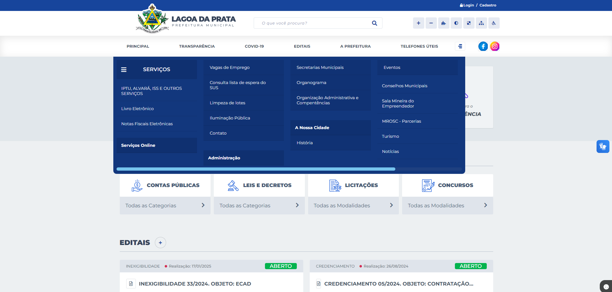

*Fonte: Prefeitura Municipal de Lagoa da Prata. 2024. Disponível em <https://www.lagoadaprata.mg.gov.br/portal/>. Acesso em 07/07/2024*

#### Correção
Padronizar o menu hambúrguer em que os subtópicos estejam alinhados e do mesmo tamanho como mostrado em "Serviços" e "Serviços Online" que estão desalinhados dificultando e muito a compreensão do usuário.

### Promovendo a Eficiência do Usuário
#### Definição
A eficiência do usuário vem sempre em primeiro lugar, e não a do computador. [4] O usuário deve ser mantido ocupado, logo , processamentos demorados não devem prender a interação, mas sim permitir que os usuários continuem seu trabalho com outras partes do sistema, suprimindo a ociosidade e economizando tempo e esforço do usuário.

#### Violação
Há algumas funcionalidades no site em que redireciona o usuário para outros links sem uma alternativa de retorno para a página em que o usuário estava anteriormente notando-se uma violação em promover a eficiência do usuário que terá que usar o botão do navegador ou acessar novamente a página do site da Prefeitura, como mostra a figura 07 a seguir que ao clicar em transparência no menu suspenso é redirecionado para um link externo sem opção de volta mostrado na figura 08.

**Figura 07** - Menu Suspenso

*Fonte: Prefeitura Municipal de Lagoa da Prata. 2024. Disponível em <https://www.lagoadaprata.mg.gov.br/portal/>. Acesso em 07/07/2024*

**Figura 08** - Página de Transparência

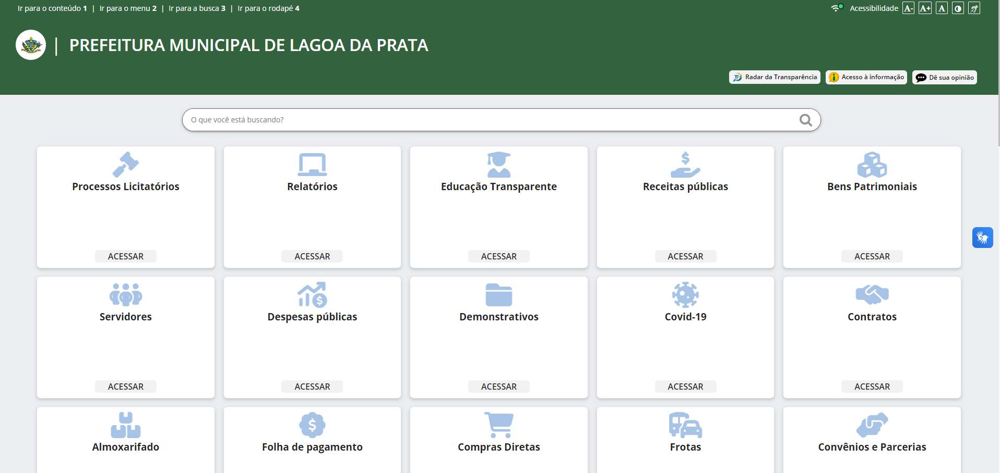

*Fonte: Prefeitura Municipal de Lagoa da Prata. 2024. Disponível em <https://transparencia.betha.cloud/#/5jrYiAhzcWF174nC3B1Hkw==>. Acesso em 07/07/2024*

#### Correção
Implementação de um botão de retorno dentro dos sites que o usuário é redirecionado para que caso ocorra um clique errado ou o usuário decida voltar por quaisquer outro motivo não tenha que abrir outra página e acessar tudo novamente ou usar o botão retroceder do navegador.

### Antecipação
#### Definição
Deve ser fornecido todas as informações e ferramentas necessárias ao usuário para cada passo realizado, fazendo com que não seja necessário o usuário buscar ou coletar informações.

#### Violação
Mesmo já estando cadastrado e logado no site da Prefeitura, ao tentar realizar a solicitação de troca de lâmpadas, o site requer que o usuário preenche dados que poderiam ter sido puxados do perfil, como nome do requerente, email, telefone para contato; como mostrado na figura 09 abaixo.

**Figura 09** - Página de solicitação de troca de lâmpadas

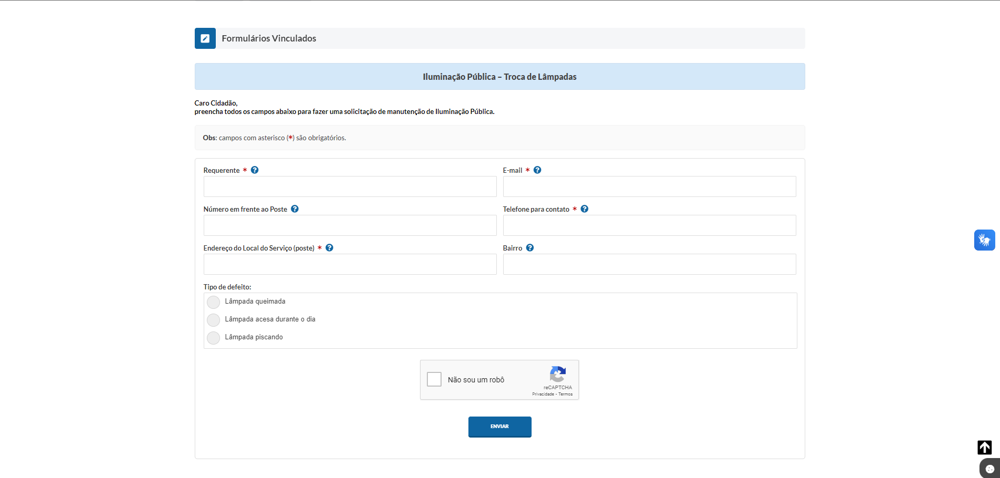

*Fonte: Prefeitura Municipal de Lagoa da Prata. 2024. Disponível em <https://www.lagoadaprata.mg.gov.br/portal/>. Acesso em 07/07/2024*

#### Correção
O site deveria puxar os dados do usuário que já estiver logado para evitar que seja necessário ele buscar/coletar informações que já estão disponibilizadas, deixando o campo editavel caso o usuário queira trocar o mesmo.

### Visibilidade e Reconhecimento
#### Definição
Antes de executar uma ação, o usuário deve ter uma visão prévia das diferentes maneiras de realizá-la e das instruções para sua execução. Além disso, a interface deve fornecer informações lógicas e acessíveis ao usuário no momento necessário.[3]

#### Violação
Ao clicar no botão de troca de contraste do site e colocar em baixo contraste a visibilidade dos botões fica muito difícil e pouco intuitivo para os usuários reconhecerem, o menu hambúrguer mesmo aparece apenas como um quadrado vazio, como mostrado na figura 10 a seguir.

**Figura 09** - Página de solicitação de troca de lâmpadas

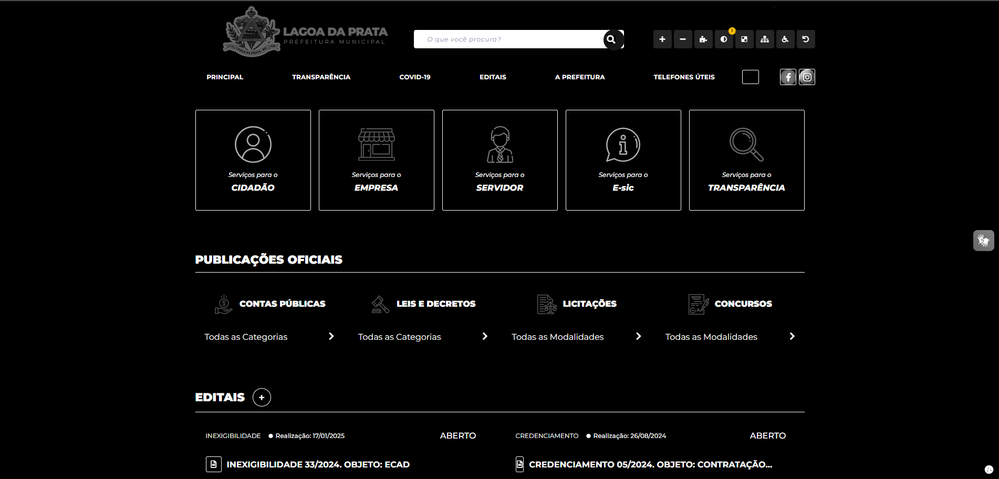

*Fonte: Prefeitura Municipal de Lagoa da Prata. 2024. Disponível em <https://www.lagoadaprata.mg.gov.br/portal/>. Acesso em 08/07/2024*

#### Correção
Corrgir a opção de baixo contraste para que as o botões e imagens fiquem de facil reconhecimento e a visibilidade não seja prejudicada atendendo a descrição do usuário ter uma visão prévia de realizar as ações.

### Conteúdo Relevante e Expressão Adequada 
#### Definição
A interação polida segue quatro máximas[8] que serão adotadas no projeto sendo elas:
- qualidade - não dizer nada que não tenha um embasamento, sem mentiras ou especulações
- quantidade - busca pela simplicidade, a fala deve ser tão informativa quanto necessária para os objetivos
- relação (ou relevância) - tudo que for dito tem que ser explicítamente relacionado aos tópicos da conversa
- modo ( ou clareza) - evitar ao máximo ambiguidade e prolixidade

#### Violação
Ao abrir o menu hambúrguer o usuário fica confuso com relação aos tópicos "Serviços" e "Serviços Online", gerando uma ambíguidade, como mostra a figura 11 a seguir. 

**Figura 11** - Menu Hambúrguer

*Fonte: Prefeitura Municipal de Lagoa da Prata. 2024. Disponível em <https://www.lagoadaprata.mg.gov.br/portal/>. Acesso em 08/07/2024*

#### Correção
Essa violação poderia ser facilmente resolvida trocando o subtópico "Serviços Online" para "Solicitação de Serviços", o que acabaria com a ambiguidade.

### Projeto para Erros 
#### Definição
Para Norman(1998)[3], deve-se projetar para o erro, assumindo que qualquer erro em potencial será cometido. Sendo assim, o sistema deve ajudar o usuário a se recuperar de um erro, informando o que ocorreu, as consequências do erro e como reverter.

#### Violação
Ao tentar alterar o estado e outros campos no perfil do site da Prefeitura, o usuário recebe o erro de campo de CPF vazio mesmo o campo sendo preenchido automaticamente pois no cadastro é informado o CPF e não é possível mudar o mesmo. Ou seja foi informado um erro que não existe logo o sistema não ajuda o usuário a se recuperar do erro, informa erronemanete o que aconteceu, aparece uma imagem de X informado que o cadastro não foi alterado mas para pessoas leigas não é o suficiente para o entedimento e essa consequência deve estar escrita.
Logo abaixo segue as figuras 12 que mostra o cadastro como estava, a figura 13 que mostra alterando o estado, e a figura 14 mostrando a mensagem de erro informada pelo sistema. (o campo CPF está borrado para proteção de dados do integrante do grupo que fez a inspeção).

**Figura 12** - Perfil do site da Prefeitura

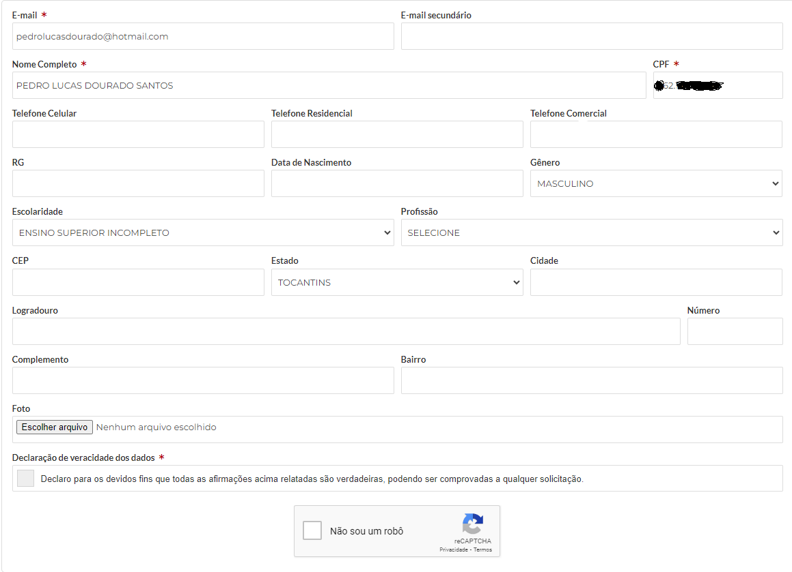

*Fonte: Prefeitura Municipal de Lagoa da Prata. 2024. Disponível em <https://www.lagoadaprata.mg.gov.br/portal/>. Acesso em 08/07/2024*

**Figura 13** - Perfil do site da Prefeitura alterado

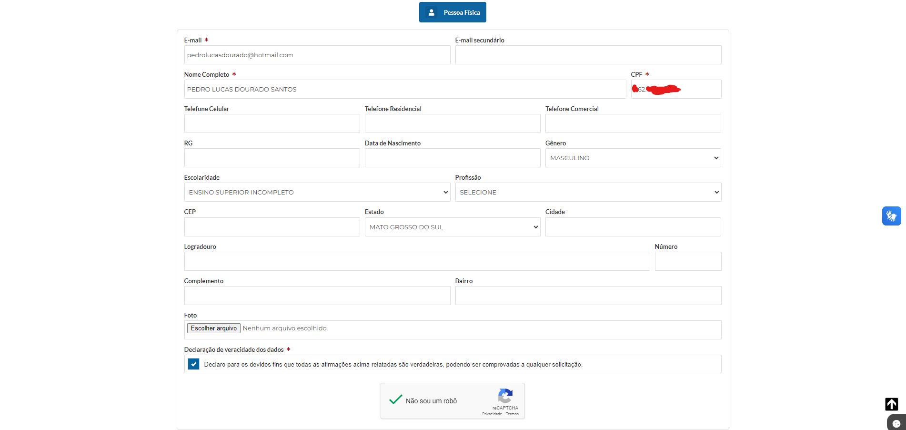

*Fonte: Prefeitura Municipal de Lagoa da Prata. 2024. Disponível em <https://www.lagoadaprata.mg.gov.br/portal/>. Acesso em 08/07/2024*

**Figura 14** - Erro CPF em branco

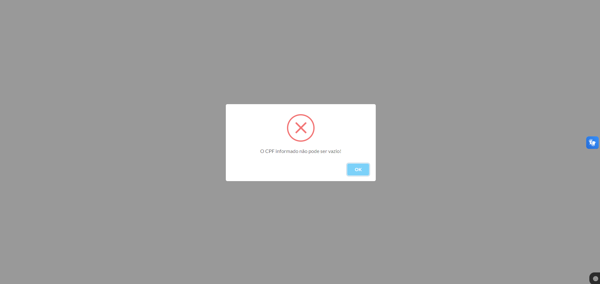

*Fonte: Prefeitura Municipal de Lagoa da Prata. 2024. Disponível em <https://www.lagoadaprata.mg.gov.br/portal/>. Acesso em 08/07/2024*

#### Correção
Retirar o erro uma vez que todos os campos obrigatórios estão preenchidos inclusive o de CPF, e caso haja um campo obrigatório não preenchido a mensagem de erro deve conter corretamente o campo que está vazio, que a ação de alteração do cadastro do perfil do usuário não foi realizado (além da imagem de "X"), informar como proceder para reverter o erro (Por favor preencha o campo "nome do campo" vazio).

## Referenciais Bibliográficos

> [1] Barbosa, S. D. J.; Silva, B. S. da; Silveira, M. S.; Gasparini, I.; Darin, T.; Barbosa, G. D. J. (2021) Interação Humano-Computador e Experiência do usuário. Autopublicação.

> [2] Mayhew, Deborah J. (1999). The Usability Engineering Lifecycle: A Practitioner’s Handbook for User Interface Design. Morgan Kaufmann, 1st edition edition.

> [3] Norman, Don (1988). The Psychology Of Everyday Things. Basic Books, New York, illustrated edition edition.

> [4] Tognazzini, Bruce (2014). First Principles of Interaction Design (Revised & Expanded).

> [5] Reeves, Byron e Nass, Clifford (1996). The Media Equation: How People Treat Computers, Television, and New Media Like Real People and Places. Cambridge University Press/CSLI, Stanford, Calif, new edition edition.

> [6] Shneiderman, Ben (1998). Designing the User Interface: Strategies for Effective Human Computer Interaction. Addison-Wesley

> [7] Grice, H. Paul (1975). Logic and Conversation. In Syntax and Semantics, volume 3 - Speech Acts, pages 41–58. Academic Press, edited by peter cole and jerry l. morgan edition

## Historico de Versões

|    Data    | Versão |                                                                    Descrição                                                                     |                                     Autor(es) | Data de revisão |                 Revisor(es)                  |
| :--------: | :----: | :----------------------------------------------------------------------------------------------------------------------------------------------: | --------------------------------------------: | :-------------: | :------------------------------------------: |
| 11/05/2024 | `1.0`  |                                                               Criação do documento                                                               | [Joyce Dionizio](https://github.com/joycejdm) |   13/05/2024    | [Augusto Duarte](https://github.com/Augcamp) |
| 11/05/2024 | `1.1`  |                                                             Elaboração do documento                                                              |  [Lucas Meireles](https://github.com/Katuner) |   13/05/2024    | [Augusto Duarte](https://github.com/Augcamp) |
| 07/07/2024 | `2.0`  |                                            Reestruturação completa do documento, TUDO foi refatorado                                             |   [Pedro Lucas](https://github.com/lucasdray) |   07/07/2024    | [Pedro Lucas](https://github.com/lucasdray)  |
| 08/07/2024 | `2.1`  | Adição Visibilidade e Reconhecimento, Conteúdo Relevante e Expressão Adequada, Projeto para Erros e subtópico de correção em todos os príncipios |   [Pedro Lucas](https://github.com/lucasdray) |                 |                                              |