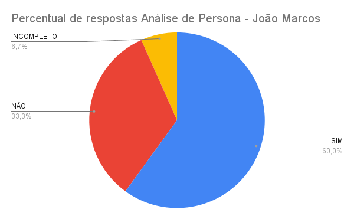

# Inspeção do artefato "Personas"

## Introdução

Dado o planejamento da atividade, aqui será exibido o procedimento realizado e os eventuais resultados encontrados pela atividade de verificação descrita no [planejamento de verificação da etapa](planejamento.md) referente à etapa 2 para o [grupo 5](https://github.com/Interacao-Humano-Computador/2024.1-Prefeitura-Lagoa-da-Prata) da disciplina de IHC.

## Objetivo

O objetivo desse documento é apresentar a metodologia adotada, os autores, o checklist do artefato ["Personas"](../../../requisitos1/personas.md) produzido e seus respectivos resultados, conforme descritos no [planejamento](planejamento.md). 

## Metodologia
Para responder as perguntas dos checklists feitos anteriormente no [planejamento](planejamento.md), o avaliador usará o método de inspeção para responder as perguntas com as opções "SIM", "NÃO" e "INCOMPLETO". Também será gerado um espaço adicional para que possa escrever observações em cada pergunta.
Ao completar a verificação da checklist do artefato, será apresentado um gráfico "pizza" com as respostas para uma melhor visualização assim como os problemas encontrados e sugestões de correções, quando cabível.

## Objetos de verificação
A Tabela 1 foi produzida para uma melhor visualização do objeto que será aqui verificado e suas respectivas características. Ela é composta pelo artefato que foi verificado, a versão verificada, data de produção, autores e revisores do artefato conforme presentes no próprio artefato em relação à versão que será aqui avaliada, no dia em que se é realizado cada uma das verificações.
Visto que todos os integrantes possuem contribuições que devem ser analisadas individualmente, será adotado uma sequência alfabética para a responsabilidade de verificação, isto é, o primeiro integrante na ordem alfabética, Augusto Duarte, será o responsável pela verificação do próximo nome da ordem, Cainã Freitas, este qual será responsável pela verificação do integrante a seguir, Joyce Dionízio, seguida por Lucas Meireles, então Pedro Lucas e, por fim, finaliza-se a lista retornando à Augusto Duarte.

**Tabela 1** - Artefato que será verificado

|                   Artefato                   | Versão | Data produzido |                Produzido por                |                 Revisado por                 |
| :------------------------------------------: | :----: | :------------: | :-----------------------------------------: | :------------------------------------------: |
| [Personas](../../../requisitos1/personas.md) | `2.0`  |   06/06/2024   | [Pedro Lucas](https://github.com/lucasdray) | [Augusto Duarte](https://github.com/Augcamp) |

*Fonte: [MEIRELES, Lucas O.](https://github.com/Katuner). 2024.*

## Participantes

Os integrantes responsáveis pela verificação da checklist estão devidamente descritos na tabela 02 abaixo, tal como o artefato que será verificado, o autor da lista de verificação que será utilizada conforme previsto no [planejamento da verificação](planejamento.md) e a data em que se foi realizada a verificação:

**Tabela 02** - Responsáveis pela verificação e autores da checklist

|                   Artefato                   |          Responsável pela checklist           |                                                                                                     Responsável pela verificação                                                                                                      | Data da verificação |
| :------------------------------------------: | :-------------------------------------------: | :-----------------------------------------------------------------------------------------------------------------------------------------------------------------------------------------------------------------------------------: | :-----------------: |
| [Personas](../../../requisitos1/personas.md) | [Joyce Dionizio](https://github.com/joycejdm) | [Augusto Duarte](https://github.com/Augcamp), [Cainã Freitas](https://github.com/freitasc), [Joyce Dionizio](https://github.com/joycejdm), [Lucas Meireles](https://github.com/Katuner) e [Pedro Lucas](https://github.com/lucasdray) |     26/06/2024      |

*Fonte: [MEIRELES, Lucas O.](https://github.com/Katuner). 2024.*

## Resultados obtidos

Abaixo se encontram os resultados da inspeção do artefato tratado pela tabela 2 com a utilização da checklist proposta, seus comentários, o vídeo de inspeção, um gráfico "pizza" que apresentará o percentual de respostas da checklist, uma listagem de problemas encontrados e suas explicações e/ou observações e, por fim, sugestões de correção.
A cada tópico será apresentado uma análise distinta de cada membro conforme planejado.

### Persona João Marcos - Augusto Duarte

Aqui serão dispostos os resultados da verificação do artefato ["Personas"](../../../requisitos1/personas.md), com direcionamento à persona "João Marcos", proposta pelo membro [Joyce Dionizio](https://github.com/joycejdm) , feitos pelo integrante [Pedro Lucas](https://github.com/lucasdray) conforme o [planejamento da verificação](planejamento.md).

#### Inspeção

Abaixo se encontra o Vídeo 1, referente à inspeção realizada ao artefato ["Personas"](../../../requisitos1/personas.md), com direcionamento à persona "João Marcos".

**Vídeo 1** - Gravação da inspeção da "Persona" - João Marcos.

<iframe width="560" height="315" src="https://www.youtube.com/embed/AGGqiBX8Qm8?si=D3qw7yzaAOOyZZ9O" title="YouTube video player" frameborder="0" allow="accelerometer; autoplay; clipboard-write; encrypted-media; gyroscope; picture-in-picture; web-share" referrerpolicy="strict-origin-when-cross-origin" allowfullscreen></iframe>

Acesso disponível em: https://www.youtube.com/watch?v=AGGqiBX8Qm8

#### Checklists

A tabela 3 abaixo apresenta a checklist proposta pela integrante [Joyce Dionizio](https://github.com/joycejdm) durante o [planejamento da verificação](planejamento.md) com suas verificações e observações feitas pela inspeção do integrante [Pedro Lucas](https://github.com/lucasdray).

**Tabela 3** - Cheklist Persona 1

| ID  | Descrição                                                                                              | Avaliação  | Observações                                                            | Fonte                                                                                                                                                             |
| :-: | ------------------------------------------------------------------------------------------------------ | ---------- | ---------------------------------------------------------------------- | ----------------------------------------------------------------------------------------------------------------------------------------------------------------- |
| 44  | A persona tem um nome e sobrenome representativo do perfil do usuário?                                 | SIM        | -                                                                      | [Página 168](https://github.com/Interacao-Humano-Computador/2024.1-Prefeitura-Lagoa-da-Prata/blob/main/docs/assets/images/verificacao/personas/id44.png?raw=true) |
| 45  | São fornecidas a idade e outras informações demográficas da persona?                                   | SIM        | -                                                                      | [Página 168](https://github.com/Interacao-Humano-Computador/2024.1-Prefeitura-Lagoa-da-Prata/blob/main/docs/assets/images/verificacao/personas/id44.png?raw=true) |
| 46  | A persona inclui uma foto para tornar sua representação mais realista?                                 | SIM        | -                                                                      | [Página 168](https://github.com/Interacao-Humano-Computador/2024.1-Prefeitura-Lagoa-da-Prata/blob/main/docs/assets/images/verificacao/personas/id44.png?raw=true) |
| 47  | A persona é definida como primária, secundária, outro stakeholder ou antiusuário?                      | SIM        | Na figura da persona trocar persona por anti persona                   | [Página 168](https://github.com/Interacao-Humano-Computador/2024.1-Prefeitura-Lagoa-da-Prata/blob/main/docs/assets/images/verificacao/personas/id44.png?raw=true) |
| 48  | Está claro qual é o papel da persona no sistema?                                                       | SIM        | -                                                                      | [Página 168](https://github.com/Interacao-Humano-Computador/2024.1-Prefeitura-Lagoa-da-Prata/blob/main/docs/assets/images/verificacao/personas/id44.png?raw=true) |
| 49  | Os objetivos da persona são claramente definidos?                                                      | SIM        | -                                                                      | [Página 168](https://github.com/Interacao-Humano-Computador/2024.1-Prefeitura-Lagoa-da-Prata/blob/main/docs/assets/images/verificacao/personas/id44.png?raw=true) |
| 50  | Os objetivos incluem metas além do produto específico, abrangendo aspectos pessoais e profissionais?   | NÃO        | Os objetivos mostrados tem relação apenas com o site                   | [Página 168](https://github.com/Interacao-Humano-Computador/2024.1-Prefeitura-Lagoa-da-Prata/blob/main/docs/assets/images/verificacao/personas/id44.png?raw=true) |
| 51  | As habilidades da persona, incluindo educação, treinamento e competências específicas, são descritas?  | INCOMPLETO | Falta detalhamento                                                     | [Página 168](https://github.com/Interacao-Humano-Computador/2024.1-Prefeitura-Lagoa-da-Prata/blob/main/docs/assets/images/verificacao/personas/id44.png?raw=true) |
| 52  | Essas habilidades são relevantes para a interação com o produto?                                       | SIM        | -                                                                      | [Página 168](https://github.com/Interacao-Humano-Computador/2024.1-Prefeitura-Lagoa-da-Prata/blob/main/docs/assets/images/verificacao/personas/id44.png?raw=true) |
| 53  | As tarefas básicas ou críticas que a persona realiza são claramente descritas?                         | SIM        | -                                                                      | [Página 168](https://github.com/Interacao-Humano-Computador/2024.1-Prefeitura-Lagoa-da-Prata/blob/main/docs/assets/images/verificacao/personas/id44.png?raw=true) |
| 54  | A frequência, importância e duração dessas tarefas são especificadas?                                  | NÃO        | Pode-se adicionar tarefas sem relação ao site                          | [Página 168](https://github.com/Interacao-Humano-Computador/2024.1-Prefeitura-Lagoa-da-Prata/blob/main/docs/assets/images/verificacao/personas/id44.png?raw=true) |
| 55  | Os relacionamentos da persona com outros stakeholders são identificados?                               | NÃO        | -                                                                      | [Página 168](https://github.com/Interacao-Humano-Computador/2024.1-Prefeitura-Lagoa-da-Prata/blob/main/docs/assets/images/verificacao/personas/id44.png?raw=true) |
| 56  | As necessidades da persona são detalhadas e incluem citações que ajudam a entender essas necessidades? | NÃO        | Mesmo sendo anti persona pode-se detalhar as necessidades fora do site | [Página 168](https://github.com/Interacao-Humano-Computador/2024.1-Prefeitura-Lagoa-da-Prata/blob/main/docs/assets/images/verificacao/personas/id44.png?raw=true) |
| 57  | As expectativas da persona sobre como o produto deve funcionar estão claramente definidas?             | SIM        | Não condiz com a pergunta por ser anti persona                         | [Página 168](https://github.com/Interacao-Humano-Computador/2024.1-Prefeitura-Lagoa-da-Prata/blob/main/docs/assets/images/verificacao/personas/id44.png?raw=true) |
| 58  | A organização das informações no domínio ou trabalho da persona é descrita?                            | NÃO        | -                                                                      | [Página 168](https://github.com/Interacao-Humano-Computador/2024.1-Prefeitura-Lagoa-da-Prata/blob/main/docs/assets/images/verificacao/personas/id44.png?raw=true) |

*Fonte: [DIONIZIO, Joyce](https://github.com/joycejdm). 2024*

Segue abaixo, pela Figura 1, o gráfico referente às respostas da checklist prevista pela tabela 3.

**Figura 1** - Gráfico "pizza" - Personas - NOME PERSONA

*Fonte: [DOURADO, Pedro Lucas](https://github.com/lucasdray). 2024*

#### Problemas encontrados

Abaixo se encontra a lista de problemas encontrados na persona avaliada, utilizando também como referência o ID das perguntas conforme dispostos na tabela 3 para melhor localização.

**ID 50** - Os objetivos incluem metas além do produto específico, abrangendo aspectos pessoais e profissionais?
- Não apresentado, objetivos mostrados tem relação apenas com o site

**ID 51** - As habilidades da persona, incluindo educação, treinamento e competências específicas, são descritas?
- Falta um detalhamento apronfudado.

**ID 54** - A frequência, importância e duração dessas tarefas são especificadas?

- Não apresentado.

**ID 55** - Os relacionamentos da persona com outros stakeholders são identificados?

- Não apresentado.

**ID 56** - As necessidades da persona são detalhadas e incluem citações que ajudam a entender essas necessidades?

- Não apresentado.

**ID 58** - A organização das informações no domínio ou trabalho da persona é descrita?

- Não apresentado.

#### Sugestões de correção

Para a correção da persona avaliada, sugerem-se os itens a seguir:

- Incluir necessidades.
- Incluir relacionamentos com outros stakeholders.
- Incluir frequência, importância e duração das tarefas.
- Incluir objetivos além de funções relacionadas ao site.
- Incluir habilidades da persona.
- Incluir organização das informações do trabalho da persona.

## Persona Eduardo Silva - Responsável [Cainã Freitas](https://github.com/freitasc)

Aqui serão dispostos os resultados da verificação do artefato ["Personas"](../../../requisitos1/personas.md), com direcionamento à persona "Eduardo Silva", proposta pelo membro [Cainã Freitas](https://github.com/freitasc), feitos pelo integrante [Augusto Duarte](https://github.com/Augcamp) conforme o [planejamento da verificação](planejamento.md).

#### Inspeção

Abaixo se encontra o Vídeo 3, referente à inspeção realizada ao artefato ["Personas"](../../../requisitos1/personas.md), com direcionamento à persona "Eduardo Silva".

**Vídeo 3** - Gravação da inspeção da "Persona" - Eduardo Silva.

<iframe width="560" height="315" src="https://www.youtube.com/embed/q5nC4qWaFk8?si=ZA7E4-xT9TNsWIjZ" title="YouTube video player" frameborder="0" allow="accelerometer; autoplay; clipboard-write; encrypted-media; gyroscope; picture-in-picture; web-share" referrerpolicy="strict-origin-when-cross-origin" allowfullscreen></iframe>

Acesso disponível em: <https://www.youtube.com/watch?v=q5nC4qWaFk8>

#### Checklists

A tabela 5 abaixo apresenta a checklist proposta pela integrante [Joyce Dionizio](https://github.com/joycejdm) durante o [planejamento da verificação](planejamento.md) com suas verificações e observações feitas pela inspeção do integrante [Augusto Duarte](https://github.com/Augcamp).

| ID  | Descrição  | Avaliação  | Observações  | Fonte  |
| :-: | ---------  | ---------  | -----------  | -----  |
| 44  | A persona tem um nome e sobrenome representativo do perfil do usuário?  | SIM  | -  | [Página 168](https://github.com/Interacao-Humano-Computador/2024.1-Prefeitura-Lagoa-da-Prata/blob/main/docs/assets/images/verificacao/personas/id44.png?raw=true)  |
| 45  | São fornecidas a idade e outras informações demográficas da persona?  | SIM  | -  | [Página 168](https://github.com/Interacao-Humano-Computador/2024.1-Prefeitura-Lagoa-da-Prata/blob/main/docs/assets/images/verificacao/personas/id44.png?raw=true)  |
| 46  | A persona inclui uma foto para tornar sua representação mais realista?  | SIM  | -  | [Página 168](https://github.com/Interacao-Humano-Computador/2024.1-Prefeitura-Lagoa-da-Prata/blob/main/docs/assets/images/verificacao/personas/id44.png?raw=true)  |
| 47  | A persona é definida como primária, secundária, outro stakeholder ou antiusuário?  | SIM  | -  | [Página 168](https://github.com/Interacao-Humano-Computador/2024.1-Prefeitura-Lagoa-da-Prata/blob/main/docs/assets/images/verificacao/personas/id44.png?raw=true)  |
| 48  | Está claro qual é o papel da persona no sistema?  | SIM  | -  | [Página 168](https://github.com/Interacao-Humano-Computador/2024.1-Prefeitura-Lagoa-da-Prata/blob/main/docs/assets/images/verificacao/personas/id44.png?raw=true)  |
| 49  | Os objetivos da persona são claramente definidos?  | SIM  | -  | [Página 168](https://github.com/Interacao-Humano-Computador/2024.1-Prefeitura-Lagoa-da-Prata/blob/main/docs/assets/images/verificacao/personas/id44.png?raw=true)  |
| 50  | Os objetivos incluem metas além do produto específico, abrangendo aspectos pessoais e profissionais?  | SIM  | -  | [Página 168](https://github.com/Interacao-Humano-Computador/2024.1-Prefeitura-Lagoa-da-Prata/blob/main/docs/assets/images/verificacao/personas/id44.png?raw=true)  |
| 51  | As habilidades da persona, incluindo educação, treinamento e competências específicas, são descritas?  | SIM  | -  | [Página 168](https://github.com/Interacao-Humano-Computador/2024.1-Prefeitura-Lagoa-da-Prata/blob/main/docs/assets/images/verificacao/personas/id44.png?raw=true)  |
| 52  | Essas habilidades são relevantes para a interação com o produto?  | SIM  | -  | [Página 168](https://github.com/Interacao-Humano-Computador/2024.1-Prefeitura-Lagoa-da-Prata/blob/main/docs/assets/images/verificacao/personas/id44.png?raw=true)  |
| 53  | As tarefas básicas ou críticas que a persona realiza são claramente descritas?  | SIM  | -  | [Página 168](https://github.com/Interacao-Humano-Computador/2024.1-Prefeitura-Lagoa-da-Prata/blob/main/docs/assets/images/verificacao/personas/id44.png?raw=true)  |
| 54  | A frequência, importância e duração dessas tarefas são especificadas?  | INCOMPLETO  | As tarefas não tem a duração especificada.  | [Página 168](https://github.com/Interacao-Humano-Computador/2024.1-Prefeitura-Lagoa-da-Prata/blob/main/docs/assets/images/verificacao/personas/id44.png?raw=true)  |
| 55  | Os relacionamentos da persona com outros stakeholders são identificados?  | SIM  | -  | [Página 168](https://github.com/Interacao-Humano-Computador/2024.1-Prefeitura-Lagoa-da-Prata/blob/main/docs/assets/images/verificacao/personas/id44.png?raw=true)  |
| 56  | As necessidades da persona são detalhadas e incluem citações que ajudam a entender essas necessidades?  | SIM  | -  | [Página 168](https://github.com/Interacao-Humano-Computador/2024.1-Prefeitura-Lagoa-da-Prata/blob/main/docs/assets/images/verificacao/personas/id44.png?raw=true)  |
| 57  | As expectativas da persona sobre como o produto deve funcionar estão claramente definidas?  | SIM  | -  | [Página 168](https://github.com/Interacao-Humano-Computador/2024.1-Prefeitura-Lagoa-da-Prata/blob/main/docs/assets/images/verificacao/personas/id44.png?raw=true)  |
| 58  | A organização das informações no domínio ou trabalho da persona é descrita?  | SIM  | -  | [Página 168](https://github.com/Interacao-Humano-Computador/2024.1-Prefeitura-Lagoa-da-Prata/blob/main/docs/assets/images/verificacao/personas/id44.png?raw=true)  |

Fonte: [DIONIZIO, Joyce](https://github.com/joycejdm). 2024

### Acompanhamento 

A figura 03 abaixo apresenta o gráfico "pizza" referente às respostas da verificação da tabela 5.

**Figura 03** - Gráfico dos resultados da Persona "Eduardo Silva" 

<iframe width="600" height="371" seamless frameborder="0" scrolling="no" src="https://docs.google.com/spreadsheets/d/e/2PACX-1vSRcmR4qQg-l_N1LtAHpMdDeaYhnQBNL4a3Khhe0EhPRJ7XaTa0m9bumDuol8_yqx4PA00f_VwJkhrY/pubchart?oid=1741849523&amp;format=image"></iframe>

*Fonte: [DUARTE, Augusto](https://github.com/Augcamp). 2024.*

#### Problemas encontrados

Abaixo se encontra a lista de problemas encontrados na persona avaliada, utilizando também como referência o ID das perguntas conforme dispostos na tabela 3 para melhor localização.

**ID 54** - A frequência, importância e duração dessas tarefas são especificadas?

- As tarefas não têm a duração especificada, o que impede a compreensão completa da carga de trabalho e da relevância das tarefas para a persona. 

#### Sugestões de correção

Para a correção da persona avaliada, sugerem-se os itens a seguir:

- Adicionar a duração das tarefas realizadas pela persona. Isso ajudará a entender melhor a carga de trabalho e a importância de cada tarefa no contexto da interação com o produto. Detalhar a frequência e a importância das tarefas realizadas para proporcionar uma visão mais completa das atividades da persona.

### Persona Maria Oliveira - Joyce Dionizio

Aqui serão dispostos os resultados da verificação do artefato ["Personas"](../../../requisitos1/personas.md), com direcionamento à persona "Maria Oliveira", proposta pelo membro [Joyce Dionizio](https://github.com/joycejdm), feitos pelo integrante [Cainã Freitas](https://github.com/freitasc) conforme o [planejamento da verificação](planejamento.md).

#### Inspeção

Abaixo se encontra o Vídeo 1, referente à inspeção realizada ao artefato ["Personas"](../../../requisitos1/personas.md), com direcionamento à persona "Maria Oliveira".

**Vídeo 1** - Gravação da inspeção da "Persona" - Maria Oliveira.

<iframe width="560" height="315" src="https://www.youtube.com/embed/q5nC4qWaFk8?si=ZA7E4-xT9TNsWIjZ" title="YouTube video player" frameborder="0" allow="accelerometer; autoplay; clipboard-write; encrypted-media; gyroscope; picture-in-picture; web-share" referrerpolicy="strict-origin-when-cross-origin" allowfullscreen></iframe>

Acesso disponível em: <https://www.youtube.com/watch?v=q5nC4qWaFk8>

#### Checklists

A tabela 3 abaixo apresenta a checklist proposta pela integrante [Joyce Dionizio](https://github.com/joycejdm) durante o [planejamento da verificação](planejamento.md) com suas verificações e observações feitas pela inspeção do integrante [Cainã Freitas](https://github.com/freitasc).

| ID  | Descrição  | Avaliação  | Observações  | Fonte  |
| :-: | ---------  | ---------  | -----------  | -----  |
| 44  | A persona tem um nome e sobrenome representativo do perfil do usuário?  | SIM  | -  | [Página 168](https://github.com/Interacao-Humano-Computador/2024.1-Prefeitura-Lagoa-da-Prata/blob/main/docs/assets/images/verificacao/personas/id44.png?raw=true)  |
| 45  | São fornecidas a idade e outras informações demográficas da persona?  | SIM  | -  | [Página 168](https://github.com/Interacao-Humano-Computador/2024.1-Prefeitura-Lagoa-da-Prata/blob/main/docs/assets/images/verificacao/personas/id44.png?raw=true)  |
| 46  | A persona inclui uma foto para tornar sua representação mais realista?  | SIM  | -  | [Página 168](https://github.com/Interacao-Humano-Computador/2024.1-Prefeitura-Lagoa-da-Prata/blob/main/docs/assets/images/verificacao/personas/id44.png?raw=true)  |
| 47  | A persona é definida como primária, secundária, outro stakeholder ou antiusuário?  | SIM  | -  | [Página 168](https://github.com/Interacao-Humano-Computador/2024.1-Prefeitura-Lagoa-da-Prata/blob/main/docs/assets/images/verificacao/personas/id44.png?raw=true)  |
| 48  | Está claro qual é o papel da persona no sistema?  | SIM  | -  | [Página 168](https://github.com/Interacao-Humano-Computador/2024.1-Prefeitura-Lagoa-da-Prata/blob/main/docs/assets/images/verificacao/personas/id44.png?raw=true)  |
| 49  | Os objetivos da persona são claramente definidos?  | SIM  | -  | [Página 168](https://github.com/Interacao-Humano-Computador/2024.1-Prefeitura-Lagoa-da-Prata/blob/main/docs/assets/images/verificacao/personas/id44.png?raw=true)  |
| 50  | Os objetivos incluem metas além do produto específico, abrangendo aspectos pessoais e profissionais?  | SIM  | -  | [Página 168](https://github.com/Interacao-Humano-Computador/2024.1-Prefeitura-Lagoa-da-Prata/blob/main/docs/assets/images/verificacao/personas/id44.png?raw=true)  |
| 51  | As habilidades da persona, incluindo educação, treinamento e competências específicas, são descritas?  | SIM  | -  | [Página 168](https://github.com/Interacao-Humano-Computador/2024.1-Prefeitura-Lagoa-da-Prata/blob/main/docs/assets/images/verificacao/personas/id44.png?raw=true)  |
| 52  | Essas habilidades são relevantes para a interação com o produto?  | NÃO  | -  | [Página 168](https://github.com/Interacao-Humano-Computador/2024.1-Prefeitura-Lagoa-da-Prata/blob/main/docs/assets/images/verificacao/personas/id44.png?raw=true)  |
| 53  | As tarefas básicas ou críticas que a persona realiza são claramente descritas?  | SIM  | -  | [Página 168](https://github.com/Interacao-Humano-Computador/2024.1-Prefeitura-Lagoa-da-Prata/blob/main/docs/assets/images/verificacao/personas/id44.png?raw=true)  |
| 54  | A frequência, importância e duração dessas tarefas são especificadas?  | INCOMPLETO  | As tarefas não tem a duração especificada.  | [Página 168](https://github.com/Interacao-Humano-Computador/2024.1-Prefeitura-Lagoa-da-Prata/blob/main/docs/assets/images/verificacao/personas/id44.png?raw=true)  |
| 55  | Os relacionamentos da persona com outros stakeholders são identificados?  | SIM  | -  | [Página 168](https://github.com/Interacao-Humano-Computador/2024.1-Prefeitura-Lagoa-da-Prata/blob/main/docs/assets/images/verificacao/personas/id44.png?raw=true)  |
| 56  | As necessidades da persona são detalhadas e incluem citações que ajudam a entender essas necessidades?  | SIM  | -  | [Página 168](https://github.com/Interacao-Humano-Computador/2024.1-Prefeitura-Lagoa-da-Prata/blob/main/docs/assets/images/verificacao/personas/id44.png?raw=true)  |
| 57  | As expectativas da persona sobre como o produto deve funcionar estão claramente definidas?  | SIM  | -  | [Página 168](https://github.com/Interacao-Humano-Computador/2024.1-Prefeitura-Lagoa-da-Prata/blob/main/docs/assets/images/verificacao/personas/id44.png?raw=true)  |
| 58  | A organização das informações no domínio ou trabalho da persona é descrita?  | SIM  | -  | [Página 168](https://github.com/Interacao-Humano-Computador/2024.1-Prefeitura-Lagoa-da-Prata/blob/main/docs/assets/images/verificacao/personas/id44.png?raw=true)  |

Fonte: [DIONIZIO, Joyce](https://github.com/joycejdm). 2024

### Acompanhamento 

A figura 01 abaixo apresenta o gráfico "pizza" referente às respostas da verificação da tabela 3.

**Figura 01** - Gráfico dos resultados de Persona

*Fonte: [FREITAS, Cainã](https://github.com/freitasc). 2024.*

#### Problemas encontrados

Abaixo se encontra a lista de problemas encontrados na persona avaliada, utilizando também como referência o ID das perguntas conforme dispostos na tabela 3 para melhor localização.

- **ID 52** - Essas habilidades são relevantes para a interação com o produto?

    As habilidades (habilidades domésticas e de organização) não correspondem às habilidades necessárias para a interação com o produto (conhecimento basico de informática e habilidades de navegação na internet).

- **ID 54** - A frequência, importância e duração dessas tarefas são especificadas?

    As tarefas não têm a duração especificada, o que impede a compreensão completa da carga de trabalho e da relevância das tarefas para a persona. 

#### Sugestões de correção

Para a correção da persona avaliada, sugerem-se os itens a seguir:

- Adicionar a duração das tarefas realizadas pela persona. Isso ajudará a entender melhor a carga de trabalho e a importância de cada tarefa no contexto da interação com o produto. Detalhar a frequência e a importância das tarefas realizadas para proporcionar uma visão mais completa das atividades da persona.
- Alterar as habilidades da persona para refletir as habilidades necessárias para a interação com o produto. Isso ajudará a garantir que a persona seja representativa do público-alvo do produto.

### Persona Diego Lima - Lucas Meireles

Aqui serão dispostos os resultados da verificação do artefato ["Personas"](../../../requisitos1/personas.md), com direcionamento à persona "Diego Lima", proposta pelo membro [Lucas Meireles](https://github.com/Katuner), feitos pelo integrante [Joyce Dionizio](https://github.com/joycejdm) conforme o [planejamento da verificação](planejamento.md).

#### Inspeção

Abaixo se encontra o Vídeo 1, referente à inspeção realizada ao artefato ["Personas"](../../../requisitos1/personas.md), com direcionamento à persona "NOME PERSONA".

**Vídeo 1** - Gravação da inspeção da "Persona" - Diego Lima.

<iframe width="560" height="315" src="https://www.youtube.com/embed/q5nC4qWaFk8?si=ZA7E4-xT9TNsWIjZ" title="YouTube video player" frameborder="0" allow="accelerometer; autoplay; clipboard-write; encrypted-media; gyroscope; picture-in-picture; web-share" referrerpolicy="strict-origin-when-cross-origin" allowfullscreen></iframe>

Acesso disponível em: <https://www.youtube.com/watch?v=q5nC4qWaFk8>

#### Checklists

A tabela 3 abaixo apresenta a checklist proposta pela integrante [Joyce Dionizio](https://github.com/joycejdm) durante o [planejamento da verificação](planejamento.md) com suas verificações e observações feitas pela inspeção do integrante [Joyce Dionizio](https://github.com/joycejdm).

| ID  | Descrição  | Avaliação  | Observações  | Fonte  |
| :-: | ---------  | ---------  | -----------  | -----  |
| 44  | A persona tem um nome e sobrenome representativo do perfil do usuário?  | SIM  | -  | [Página 168](https://github.com/Interacao-Humano-Computador/2024.1-Prefeitura-Lagoa-da-Prata/blob/main/docs/assets/images/verificacao/personas/id44.png?raw=true)  |
| 45  | São fornecidas a idade e outras informações demográficas da persona?  | SIM  | -  | [Página 168](https://github.com/Interacao-Humano-Computador/2024.1-Prefeitura-Lagoa-da-Prata/blob/main/docs/assets/images/verificacao/personas/id44.png?raw=true)  |
| 46  | A persona inclui uma foto para tornar sua representação mais realista?  | SIM  | -  | [Página 168](https://github.com/Interacao-Humano-Computador/2024.1-Prefeitura-Lagoa-da-Prata/blob/main/docs/assets/images/verificacao/personas/id44.png?raw=true)  |
| 47  | A persona é definida como primária, secundária, outro stakeholder ou antiusuário?  | SIM  | -  | [Página 168](https://github.com/Interacao-Humano-Computador/2024.1-Prefeitura-Lagoa-da-Prata/blob/main/docs/assets/images/verificacao/personas/id44.png?raw=true)  |
| 48  | Está claro qual é o papel da persona no sistema?  | SIM  | -  | [Página 168](https://github.com/Interacao-Humano-Computador/2024.1-Prefeitura-Lagoa-da-Prata/blob/main/docs/assets/images/verificacao/personas/id44.png?raw=true)  |
| 49  | Os objetivos da persona são claramente definidos?  | SIM  | -  | [Página 168](https://github.com/Interacao-Humano-Computador/2024.1-Prefeitura-Lagoa-da-Prata/blob/main/docs/assets/images/verificacao/personas/id44.png?raw=true)  |
| 50  | Os objetivos incluem metas além do produto específico, abrangendo aspectos pessoais e profissionais?  | SIM  | -  | [Página 168](https://github.com/Interacao-Humano-Computador/2024.1-Prefeitura-Lagoa-da-Prata/blob/main/docs/assets/images/verificacao/personas/id44.png?raw=true)  |
| 51  | As habilidades da persona, incluindo educação, treinamento e competências específicas, são descritas?  | SIM  | -  | [Página 168](https://github.com/Interacao-Humano-Computador/2024.1-Prefeitura-Lagoa-da-Prata/blob/main/docs/assets/images/verificacao/personas/id44.png?raw=true)  |
| 52  | Essas habilidades são relevantes para a interação com o produto?  | SIM  | -  | [Página 168](https://github.com/Interacao-Humano-Computador/2024.1-Prefeitura-Lagoa-da-Prata/blob/main/docs/assets/images/verificacao/personas/id44.png?raw=true)  |
| 53  | As tarefas básicas ou críticas que a persona realiza são claramente descritas?  | SIM  | -  | [Página 168](https://github.com/Interacao-Humano-Computador/2024.1-Prefeitura-Lagoa-da-Prata/blob/main/docs/assets/images/verificacao/personas/id44.png?raw=true)  |
| 54  | A frequência, importância e duração dessas tarefas são especificadas?  | INCOMPLETO  | As tarefas não tem a duração especificada.  | [Página 168](https://github.com/Interacao-Humano-Computador/2024.1-Prefeitura-Lagoa-da-Prata/blob/main/docs/assets/images/verificacao/personas/id44.png?raw=true)  |
| 55  | Os relacionamentos da persona com outros stakeholders são identificados?  | SIM  | -  | [Página 168](https://github.com/Interacao-Humano-Computador/2024.1-Prefeitura-Lagoa-da-Prata/blob/main/docs/assets/images/verificacao/personas/id44.png?raw=true)  |
| 56  | As necessidades da persona são detalhadas e incluem citações que ajudam a entender essas necessidades?  | SIM  | -  | [Página 168](https://github.com/Interacao-Humano-Computador/2024.1-Prefeitura-Lagoa-da-Prata/blob/main/docs/assets/images/verificacao/personas/id44.png?raw=true)  |
| 57  | As expectativas da persona sobre como o produto deve funcionar estão claramente definidas?  | SIM  | -  | [Página 168](https://github.com/Interacao-Humano-Computador/2024.1-Prefeitura-Lagoa-da-Prata/blob/main/docs/assets/images/verificacao/personas/id44.png?raw=true)  |
| 58  | A organização das informações no domínio ou trabalho da persona é descrita?  | SIM  | -  | [Página 168](https://github.com/Interacao-Humano-Computador/2024.1-Prefeitura-Lagoa-da-Prata/blob/main/docs/assets/images/verificacao/personas/id44.png?raw=true)  |

Fonte: [DIONIZIO, Joyce](https://github.com/joycejdm). 2024

### Acompanhamento 

A figura 01 abaixo apresenta o gráfico "pizza" referente às respostas da verificação da tabela 3.

**Figura 01** - Gráfico dos resultados de Persona

*Fonte: [DIONIZIO, Joyce Dionizio](https://github.com/joycejdm). 2024.*

#### Problemas encontrados

Abaixo se encontra a lista de problemas encontrados na persona avaliada, utilizando também como referência o ID das perguntas conforme dispostos na tabela 3 para melhor localização.

- **ID 54** - A frequência, importância e duração dessas tarefas são especificadas?

    As tarefas não têm a duração especificada, o que impede a compreensão completa da carga de trabalho e da relevância das tarefas para a persona. 

#### Sugestões de correção

Para a correção da persona avaliada, sugerem-se os itens a seguir:

- Adicionar a duração das tarefas realizadas pela persona. Isso ajudará a entender melhor a carga de trabalho e a importância de cada tarefa no contexto da interação com o produto. Detalhar a frequência e a importância das tarefas realizadas para proporcionar uma visão mais completa das atividades da persona.

### Persona Maria Arlete - Pedro Lucas Dourado

Aqui serão dispostos os resultados da verificação do artefato ["Personas"](../../../requisitos1/personas.md), com direcionamento à persona "Maria Arlete", proposta pelo membro [Pedro Lucas](https://github.com/lucasdray), feitos pelo integrante [Lucas Meireles](https://github.com/Katuner) conforme o [planejamento da verificação](planejamento.md).

#### Inspeção

Abaixo se encontra o Vídeo 5, referente à inspeção realizada ao artefato ["Personas"](../../../requisitos1/personas.md), com direcionamento à persona "Maria Arlete".

**Vídeo 5** - Gravação da inspeção da "Persona" - Maria Arlete.

<iframe width="1864" height="793" src="https://www.youtube.com/embed/Mw3E4-ecpAU" title="" frameborder="0" allow="accelerometer; autoplay; clipboard-write; encrypted-media; gyroscope; picture-in-picture; web-share" referrerpolicy="strict-origin-when-cross-origin" allowfullscreen></iframe>

Acesso disponível em: <https://www.youtube.com/watch?v=Mw3E4-ecpAU>

#### Checklists

A tabela 7 abaixo apresenta a checklist proposta pela integrante [Joyce Dionizio](https://github.com/joycejdm) durante o [planejamento da verificação](planejamento.md) com suas verificações e observações feitas pela inspeção do integrante [NOME](https://github.com).

**Tabela 7** - Cheklist Persona

| ID | Descrição | Avaliação | Observações | Fonte |
| :----: | --------- | ---------- | ----------- | ------- |
| 44 | A persona tem um nome e sobrenome representativo do perfil do usuário? | Sim | - | [Página 168](https://github.com/Interacao-Humano-Computador/2024.1-Prefeitura-Lagoa-da-Prata/blob/main/docs/assets/images/verificacao/personas/id44.png?raw=true) |
| 45 | São fornecidas a idade e outras informações demográficas da persona?  | Incompleto | - | [Página 168](https://github.com/Interacao-Humano-Computador/2024.1-Prefeitura-Lagoa-da-Prata/blob/main/docs/assets/images/verificacao/personas/id44.png?raw=true) |
| 46 | A persona inclui uma foto para tornar sua representação mais realista? | Sim |  - | [Página 168](https://github.com/Interacao-Humano-Computador/2024.1-Prefeitura-Lagoa-da-Prata/blob/main/docs/assets/images/verificacao/personas/id44.png?raw=true) |
| 47 | A persona é definida como primária, secundária, outro stakeholder ou antiusuário? | Sim | -  |[Página 168](https://github.com/Interacao-Humano-Computador/2024.1-Prefeitura-Lagoa-da-Prata/blob/main/docs/assets/images/verificacao/personas/id44.png?raw=true) |
| 48 | Está claro qual é o papel da persona no sistema? | Não | - | [Página 168](https://github.com/Interacao-Humano-Computador/2024.1-Prefeitura-Lagoa-da-Prata/blob/main/docs/assets/images/verificacao/personas/id44.png?raw=true) |
| 49 | Os objetivos da persona são claramente definidos? |  Sim | - | [Página 168](https://github.com/Interacao-Humano-Computador/2024.1-Prefeitura-Lagoa-da-Prata/blob/main/docs/assets/images/verificacao/personas/id44.png?raw=true) |
| 50 | Os objetivos incluem metas além do produto específico, abrangendo aspectos pessoais e profissionais? | Incompleto | - | [Página 168](https://github.com/Interacao-Humano-Computador/2024.1-Prefeitura-Lagoa-da-Prata/blob/main/docs/assets/images/verificacao/personas/id44.png?raw=true) |
| 51 |As habilidades da persona, incluindo educação, treinamento e competências específicas, são descritas? | Sim | - | [Página 168](https://github.com/Interacao-Humano-Computador/2024.1-Prefeitura-Lagoa-da-Prata/blob/main/docs/assets/images/verificacao/personas/id44.png?raw=true) |
| 52 | Essas habilidades são relevantes para a interação com o produto? |  Sim | -  |[Página 168](https://github.com/Interacao-Humano-Computador/2024.1-Prefeitura-Lagoa-da-Prata/blob/main/docs/assets/images/verificacao/personas/id44.png?raw=true) |
| 53 | As tarefas básicas ou críticas que a persona realiza são claramente descritas?  | Sim | - | [Página 168](https://github.com/Interacao-Humano-Computador/2024.1-Prefeitura-Lagoa-da-Prata/blob/main/docs/assets/images/verificacao/personas/id44.png?raw=true) |
| 54 | A frequência, importância e duração dessas tarefas são especificadas?  | Sim | - | [Página 168](https://github.com/Interacao-Humano-Computador/2024.1-Prefeitura-Lagoa-da-Prata/blob/main/docs/assets/images/verificacao/personas/id44.png?raw=true) |
| 55 | Os relacionamentos da persona com outros stakeholders são identificados?  |  Não | - | [Página 168](https://github.com/Interacao-Humano-Computador/2024.1-Prefeitura-Lagoa-da-Prata/blob/main/docs/assets/images/verificacao/personas/id44.png?raw=true) |
| 56 | As necessidades da persona são detalhadas e incluem citações que ajudam a entender essas necessidades?  |  Incompleto | - | [Página 168](https://github.com/Interacao-Humano-Computador/2024.1-Prefeitura-Lagoa-da-Prata/blob/main/docs/assets/images/verificacao/personas/id44.png?raw=true) |
| 57 | As expectativas da persona sobre como o produto deve funcionar estão claramente definidas?  |  Sim | - | [Página 168](https://github.com/Interacao-Humano-Computador/2024.1-Prefeitura-Lagoa-da-Prata/blob/main/docs/assets/images/verificacao/personas/id44.png?raw=true) |
| 58 |A organização das informações no domínio ou trabalho da persona é descrita?  | Não | - | [Página 168](https://github.com/Interacao-Humano-Computador/2024.1-Prefeitura-Lagoa-da-Prata/blob/main/docs/assets/images/verificacao/personas/id44.png?raw=true) |

*Fonte: [DIONIZIO, Joyce](https://github.com/joycejdm). 2024*

Segue abaixo, pela Figura 5, o gráfico referente às respostas da checklist prevista pela tabela 3.

**Figura 5** - Gráfico "pizza" - Personas - Maria Arlete

*Fonte: [MEIRELES, Lucas O.](https://github.com/Katuner). 2024*

#### Problemas encontrados

Abaixo se encontra a lista de problemas encontrados na persona avaliada, utilizando também como referência o ID das perguntas conforme dispostos na tabela 3 para melhor localização.

- **ID 45** - São fornecidas a idade e outras informações demográficas da persona?

    Não há confirmação de quais são os dados necessários na checklist.

- **ID 48** - Está claro qual é o papel da persona no sistema?

    Não há menção de como a pessoa usa ou como o sistema trata a persona (cidadão comum, funcionário, etc).    

- **ID 50** - Os objetivos incluem metas além do produto específico, abrangendo aspectos pessoais e profissionais?

    Não há presença de objetivos relacionados ao produto do site.

- **ID 55** - Os relacionamentos da persona com outros stakeholders são identificados?

    Há relacionamentos com outras pessoas mas não existe uma interação com stakeholders em si.

- **ID 56** - As necessidades da persona são detalhadas e incluem citações que ajudam a entender essas necessidades?

    As necessidades estão implícitas porém não existem citações para melhor entendimento.

- **ID 58** - A organização das informações no domínio ou trabalho da persona é descrita?

    Os aspectos não estão presentes na descrição da persona.

#### Sugestões de correção

Para a correção da persona avaliada, sugerem-se os itens a seguir:

- Revisar quais são os dados demográficos necessários;
- Revisar as tarefas e objetivos para que estejam de acordo tanto com uma pessoa geral mas também com os stakeholders.
- Garantir que haja uma identificação da relação da persona com o sistema.

## Bibliografia

> Barbosa, S. D. J.; Silva, B. S. da; Silveira, M. S.; Gasparini, I.; Darin, T.; Barbosa, G. D. J. (2021) Interação Humano-Computador e Experiência do usuário. Autopublicação.

## Histórico de Versões

| Versão |    Data    |                 Descrição                 |                   Autor(es)                   | Data de revisão | Revisor(es) |
| :----: | :--------: | :---------------------------------------: | :-------------------------------------------: | :-------------: | :---------: |
| `1.0`  | 26/06/2024 | Criação do Documento e adição da inspeção | [Lucas Meireles](https://github.com/Katuner)  |   26/06/2023    |             |
| `1.1`  | 26/06/2024 |         Adiciona inspecão persona         | [Joyce Dionizio](https://github.com/joycejdm) |   26/06/2023    |             |
| `1.2`  | 26/06/2024 |      Adiciona persona 1 Joao Marques      |  [Pedro Lucas](https://github.com/lucasdray)  |                 |             |
| `1.3`  | 26/06/2024 |      Adiciona persona Eduardo Silva       |  [Augusto Duarte](https://github.com/Augcamp) |                 |             |
| `1.4` | 07/07/2024 | Ajusta posições e corrige inspeção do membro Cainã | [Lucas Meireles](https://github.com/Katuner)|   |    |